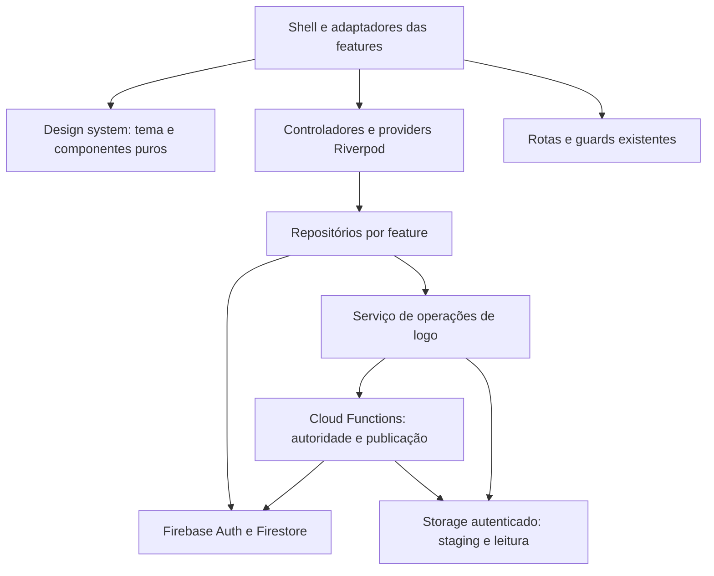
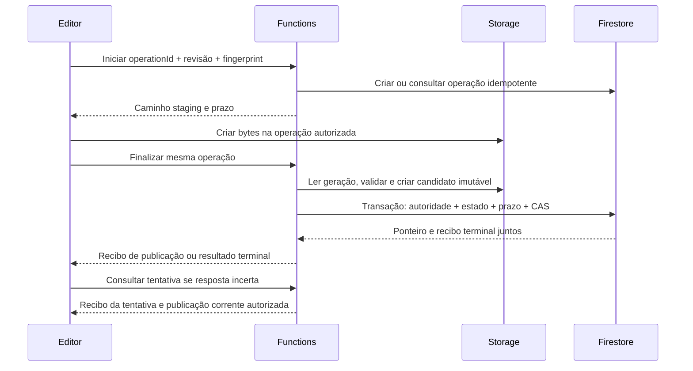

# Architecture Spine — SIGO, primeira entrega visual

Contrato de planejamento, sem implementação. `[ADOPTED]` identifica restrição do usuário, da UX ou do código existente; `[ASSUMPTION]` identifica proposta técnica do rascunho, sujeita à revisão. Documento concluído e revisado; hipóteses técnicas continuam propostas para discussão. As decisões não atestam funcionamento em produção. Revisões e ajustes: [registro de resolução](reviews/resolution-log.md).

## Design Paradigm

**Camadas por feature, com design system de apresentação puro.** Componentes compartilhados recebem dados de apresentação, estados e callbacks. Adaptadores de apresentação das features coordenam Riverpod, navegação e repositórios; backend e regras controlam autorização e publicação. O shell existente é um adaptador integrado, mesmo estando em `common_widgets`.



Não há spine pai neste recorte. A arquitetura modular de routing é **adjacente**: seus AD-1/2/4/5 divergem da composição aninhada e dos literais atuais. Esta entrega preserva rotas/guards/contexto e não resolve essa divergência incidentalmente; não altera o documento existente.

## Invariants & Rules

### AD-1 — Fronteira do design system [ASSUMPTION]

- **Binds:** shell, cards, formulários e componentes compartilhados; UX01–UX07.
- **Prevents:** componentes visuais acoplados a usuário, tenant, rota ou Firebase.
- **Rule:** o design system não importa features, providers, rotas ou persistência. Donos de feature convertem modelos em apresentação e ligam callbacks. Anatomia visual de cards, badges, botões, campos, superfícies e feedback é compartilhada; sem mover políticas de negócio para widgets genéricos. Um único editor de logo atende card e Painel Dev por adaptadores com o mesmo contrato.

### AD-2 — Tokens semânticos e tema Material [ASSUMPTION]

- **Binds:** tema global, shell e telas migradas; UX01/UX11.
- **Prevents:** cores e densidades divergentes, ou aplicação automática de dourado em estados de negócio.
- **Rule:** `ThemeData`/subtemas são a fonte de estilos Material; `ThemeExtension` reúne tokens específicos SIGO de marca, superfícies, foco, status e espaçamento. Transcrever a calibração de DESIGN.md, sem extrair cores de pixels dos mocks. `ColorScheme.primary` recebe `action-blue`, distinto de `brand-blue` decorativo; dourado é marca, não status nem `secondary` indiscriminado. Fonte padrão da plataforma/Material permanece, com escala tipográfica explícita da UX; `TextTheme` cobre texto/controles e a extensão semântica cobre títulos de página, sem aplicar 40 unidades indiscriminadamente aos títulos legados. Não introduzir pacote de fontes ou tema escuro nesta entrega. O componente escolhe o token de foco pelo fundo, inclusive branco no cabeçalho.

### AD-3 — Layout cresce com conteúdo [ADOPTED]

- **Binds:** shell, listas, cards, overlays e formulários; UX02–UX06.
- **Prevents:** cards compactos com alvos menores, texto cortado e padding duplicado.
- **Rule:** shell usa drawer até 800 unidades lógicas inclusive e sidebar acima de 800, preservando larguras 250/72. Cada superfície tem um único proprietário do inset de página: 16 por lado no telefone e 32 no desktop nas telas migradas. Construtoras espaçosas e lotes compactos seguem tokens distintos, mantendo alvos mínimos de 48. Altura de card é determinada pelo conteúdo; não impor proporção fixa. Grade usa largura útil, mínimo preferido de 320/280 para construtora/lote e uma coluna obrigatória até 800, além de uma coluna no desktop quando necessário. Texto/ações quebram linhas sem truncamento de conteúdo essencial. Header, seletor de obra e formulários também fazem reflow; overlays rolam com teclado e área segura. Ações aninhadas têm foco e acionamento independentes. Conservar semântica, restauração de foco e redução de movimento definidas pela UX.

### AD-4 — Migração incremental com limite global explícito [ASSUMPTION]

- **Binds:** integração e entrega; UX01/UX02/UX11.
- **Prevents:** ativar tema global antes de conhecer efeitos em módulos herdados ou converter redesign em refatoração de navegação.
- **Rule:** integrar tokens/componentes → shell → cards/listas → formulários → logo. Preparar o tema sem ativação global antecipada; a troca do tema raiz exige regressão das telas herdadas com controles/estilos locais. Adaptar o inset por superfície sem somar shell e tela. Preservar URLs, parâmetros, `state.extra`, contexto de construtora/obra, guards, destinos e visibilidade do menu. Troca de obra mantém o destino atual de dashboard. Não acrescentar busca, KPI, percentuais ou novos destinos sugeridos pelos mocks. Rollback visual não desfaz dados nem reabre regras permissivas.

### AD-5 — Resultado de lotes não é inferido do cache [ADOPTED]

- **Binds:** Novo Lote, Atualizar lote e seus controladores; UX07/UX08/UX11.
- **Prevents:** sucesso integral após escrita parcial, duplicação por resposta perdida e promessa de atomicidade.
- **Rule:** preservar gravações sequenciais de fase e status. O controlador acompanha separadamente `não enviada`, `confirmada`, `falhou antes da escrita` ou `incerta`; somente confirmação da operação remota permite anunciar aquele passo como salvo. Não reenviar passos incertos automaticamente nem usar leitura de cache como recibo. [ASSUMPTION] Novo Lote fixa o UUID durante a tentativa, inclusive acompanhamento após perda de resposta; não gerar outra identidade para repetir tentativa incerta. Não introduzir transação, rollback ou fila offline. Manter valores desconhecidos de fase legíveis sem coerção. Falha conserva entradas em sessão; fechamento após resultado incerto não cancela gravação. A adaptação dos repositórios deve expor evidência suficiente ou manter o resultado explicitamente incerto, sem inventar certeza.

### AD-6 — Uma autoridade por construtora [ADOPTED]

- **Binds:** entradas de gestão, staging, callables e commit; UX09.
- **Prevents:** permissão apenas visual, autorização por outra empresa ou por administração de obra.
- **Rule:** gerenciar logo exige autenticação e `dev_roles/:uid.isActive == true` ou vínculo ativo em `construtoras/:c/construtora_members/:uid` reconhecido como owner/admin pelo `manager` existente (`isOwner`, `isAdmin`, `role=owner/admin`). Usar a autoridade de construtora, não `obraAdmin`. Dev entra pelo Painel Dev; proprietário/admin pelo card. Ator vem de `context.auth`, nunca de parâmetro confiado. O alvo é fixado ao abrir o editor, com nome/CNPJ; cada etapa verifica o mesmo `c`, e a transação de publicação relê autoridade atual. Revogação impede publicação ainda não comprometida; não apaga um sucesso anterior.

### AD-7 — Ponteiro e recibos exclusivamente do servidor [ASSUMPTION]

- **Binds:** Firestore Rules, provisionamento Dev e backend; UX09/UX10.
- **Prevents:** cliente, inclusive Dev, forjar publicação ou elevar a própria autoridade.
- **Rule:** antes de disponibilizar logos, particionar o grant recursivo de escrita Dev de `firestore.rules`; nenhum `allow` sobreposto pode alcançar o campo `logo`, operações ou seus recibos/auditoria protegida. Manter ações administrativas legítimas por grants explícitos com regressão. Criação e atualização de construtora pelo cliente não podem inserir/alterar campos reservados de logo. Escrita de `dev_roles` torna-se exclusivamente servidor: retirar bootstrap por substring de e-mail e `users.globalRole`; primeiro Dev é provisionado por operador confiável via Admin SDK, e alterações usam o `setDevRole` autorizado existente. Remover também o auto-provisionamento de `trustedDevProvider` em `authentication/data/user_repository.dart`; esse provider passa a apenas ler a autoridade confiável. Preservar também o provisionamento server-side confiável existente; a restrição é contra escrita direta do cliente. Conferir o cadastro atual de Devs antes da ativação. Auditoria global gravável por Dev pode ser espelho, nunca prova exclusiva; recibo e evento protegido são gravados com o ponteiro.

### AD-8 — Publicação idempotente com revisão [ASSUMPTION]

- **Binds:** cliente, serviço de operações, Functions, Firestore e Storage; UX10.
- **Prevents:** sucesso no upload sem publicação, troca silenciosa entre administradores e duplicação após timeout.
- **Rule:** persistir `operationId` UUID aleatório global por ator antes de iniciar, com alvo e `actorUid` imutáveis. Cada chamada envia `actorUid` esperado, comparado obrigatoriamente a `context.auth.uid` antes de qualquer criação; não concede autoridade. O cliente interrompe envio/retomada se a sessão divergir do ator persistido. Usar o UUID como ID do documento no tenant; toda consulta verifica ator/alvo. Associar revisão esperada e fingerprint imutável do pedido (SHA-256 dos bytes de origem, tamanho e MIME). Repetição com mesmo identificador/fingerprint retorna a operação; divergência rejeita. Staging é create-only em caminho decidido pelo servidor, ligado à operação/ator/prazo. Respeitar o teto de dois documentos Firestore por avaliação Storage: ler operação e um único grant atual, escolhido pelo servidor em `uploadGrantKind=dev|member` e fixado ao iniciar. O caminho desse grant é derivado de ator/tenant; cliente não escolhe autoridade. Se esse grant for revogado, negar upload; finalize revalida a autoridade integral. Finalização lê geração exata, valida bytes e grava candidato imutável com precondição de inexistência. O caminho do candidato é determinístico por construtora/operação e reservado no registro: se já existir, finalizações concorrentes ou retries verificam geração/hash e fingerprint/processamento da mesma operação e reutilizam o objeto validado; nunca sobrescrevem nem adotam objeto incompatível. Ao reler a operação terminal, retornam o recibo original. Nenhum IO Storage acontece dentro do callback da transação Firestore. A transação exige construtora ainda existente e revalida autoridade, estado aberto, prazo e revisão esperada; publica ponteiro com revisão incrementada e grava recibo/evento terminal atomicamente. CAS divergente termina em `conflict`, mantém vencedor e exige nova confirmação. Repetir operação publicada retorna o mesmo recibo; nunca publica outra vez. Upload/candidato sem commit é apenas staging/órfão.



### AD-9 — Incerteza e expiração têm estado durável [ASSUMPTION]

- **Binds:** editor, consulta de resultado, retries e coleta; UX07/UX10.
- **Prevents:** imagem antiga tratada como falha, publicação tardia após retry e coleta concorrente com commit.
- **Rule:** operação nasce `pending`, com expiração em 30 minutos definida pelo servidor; estados terminais são `published`, `rejected`, `conflict` e `expired`, sem reabertura. Falha transitória não é terminal se a publicação puder continuar. Persistir identidade/recibo pendente, não bytes em fila offline. Timeout permite Fechar com aviso, bloqueia nova submissão e oferece consulta autoritativa da operação; reabertura retoma essa consulta. Consulta distingue recibo da tentativa e ponteiro atual: uma publicação pode já ter sido substituída. Ator revogado recebe somente resultado sanitizado de sua própria tentativa autenticada, sem imagem/caminho/dados atuais do tenant. Nova tentativa exige resultado terminal suficiente; alteração de arquivo usa nova identidade. Expiração é transição transacional condicionada ao estado/prazo, disputando a mesma operação com o commit. Coleta só remove staging/órfãos/versões anteriores de operações terminais após 24 horas e comprovadamente não correntes, por geração; nunca coleta candidato de operação aberta. Manter tombstone mínimo de identidade/fingerprint/resultado sem TTL nesta entrega para impedir recriação; nenhuma política de retenção pode apagá-lo antes de existir outro mecanismo equivalente. O backend é dono da expiração: start repetido, finalize e consulta terminalizam transacionalmente pending vencida antes de retornar; job periódico a cada hora cobre operações abandonadas e executa coleta após a carência de 24 horas. Falha de agenda gera alerta e acúmulo, nunca relaxa prazo no commit. Não usar TTL físico como transição de estado. IDs de construtora excluída não podem ser reutilizados; excluir a construtora não apaga recibos/tombstones necessários à resolução de operações.

### AD-10 — Imagem autenticada, validada e versionada [ASSUMPTION]

- **Binds:** modelo, processamento, Storage e cache; UX03/UX09/UX10.
- **Prevents:** MIME declarado tratado como imagem segura, vazamento por URL permanente e cache compartilhado entre usuários.
- **Rule:** namespace de logos é separado das evidências de obras. Aceitar apenas PNG/JPEG reais, até **5.242.880 bytes (5 MiB)** e 16 megapixels; rejeitar conteúdo inválido/múltiplos frames. Validar hash, tamanho e decodificação no servidor com recursos limitados; regras de MIME/tamanho são filtro inicial. Proposta de processamento: Sharp 0.35.4, orientação corrigida, ajuste dentro de 1024×1024 sem ampliar/cortar, PNG canônico sem metadados, proporção/transparência preservadas e sem recoloração deliberada. A saída também deve ter no máximo 5 MiB; excesso rejeita antes da publicação, e leitura usa esse mesmo teto. Limites são hipóteses a calibrar antes do build. O “5 MB” da UX é refinado aqui para 5 MiB; a futura interface deve explicitar “até 5 MiB (5.242.880 bytes)”, sem alterar o documento anterior. Cliente não escreve/remove objetos publicados. Leitura dos objetos privados no namespace de versões exige Dev ativo ou membro ativo da construtora, usando no máximo os dois documentos de autoridade nas Storage Rules; o cliente resolve e exibe exclusivamente o ponteiro corrente. Versões anteriores permanecem privadas e legíveis por esses mesmos autorizados até coleta, sem UI de histórico. A restrição ao ponteiro corrente é do consumo, não uma terceira consulta nas Storage Rules; não gerar URL permanente com token público. Carregar bytes autenticados com limite e cache limitado, particionado por `uid+c+revision+generation`; invalidar na publicação, logout e revogação conhecida. Confirmação/consulta também atualiza o ponteiro no modelo e invalida/refaz catálogo e cache de leitura de construtoras do mesmo ator/tenant, inclusive no retorno do Painel Dev; invalidar somente bytes não basta para o FutureProvider atual. Se o refresh falhar, preservar recibo confirmado e sinalizar catálogo desatualizado, sem regredir ao ponteiro antigo como fonte autoritativa. Não prometer recolhimento instantâneo de bytes já baixados. Falha usa iniciais mantendo nome. Sem remoção de logo na UI.

### AD-11 — Ativação exige prova do ambiente e dos contratos [ASSUMPTION]

- **Binds:** implantação, testes e operação; UX01–UX11.
- **Prevents:** UI liberada antes das regras, infraestrutura presumida e regressões externas ao recorte.
- **Rule:** usar Firebase e o pipeline existentes; validar primeiro nos emuladores Auth/Firestore/Storage/Functions, depois em ambiente isolado com runtime e binário Sharp compatíveis. Node 20 é baseline local, mas está deprecated desde 2026-04-30 e tem decommission previsto para 2026-10-30: propor Node 22 na primeira geração antes da ativação, com teste de compatibilidade dos SDKs/Sharp e calendário oficial reconferido. Nenhum upgrade executado neste planejamento. Conferir projeto/bucket/região, IAM de integração Storage/Firestore, plano, agendamento e limites antes de deploy; não presumir valores de produção. Disponibilizar gestão de logos somente após backend, regras restritivas e protocolo aprovados. Logs correlacionam operação/tenant/ator/resultado, sem bytes, tokens ou URLs privadas; medir falhas, conflitos, pendências antigas e coleta. Rollback desabilita novas operações/editor mantendo leitura, consulta de recibos e proteção server-only. Testes de aceite incluem a matriz UX e concorrência/permissões descritas abaixo; nenhum foi executado neste planejamento.

## Consistency Conventions

| Concern | Convention |
|---|---|
| Modelo de logo | `logo` opcional na construtora; ausente = iniciais/revisão zero, sem backfill. Publicado contém `objectPath`, `generation`, `sha256`, `contentType`, `byteSize`, `width`, `height`, `revision`, `publishedAt`, `publishedBy`. Datas do servidor; revisão monotônica por construtora |
| Operações | `construtoras/:c/logo_operations/:operationId`; UUID, ator, fingerprint e alvo imutáveis. Timestamps do servidor e revisões inteiras; sourceSha256 é hash hexadecimal SHA-256 dos bytes originais; fingerprint do pedido é calculado pelo servidor sobre alvo, revisão esperada, sourceSha256, sourceByteSize e sourceContentType com codificação canônica, não serialização JSON dependente do cliente |
| API mínima proposta | Callables `startConstrutoraLogo({actorUid, construtoraId, operationId, expectedRevision, sourceSha256, sourceByteSize, sourceContentType})`, `finalizeConstrutoraLogo({actorUid, construtoraId, operationId})` e `getConstrutoraLogoOperation({actorUid, construtoraId, operationId})`. Retorno comum `operationId`, `status`, `expiresAt`; start acrescenta `stagingPath`; resultado terminal acrescenta `receipt` com revisão publicada ou motivo. Consulta autorizada acrescenta `currentLogo`; consulta sanitizada omite caminhos/tenant. Nenhum endpoint aceita autoridade declarada pelo cliente |
| Erros | Separar validação, sem autorização, conflito, expiração, falha comprovada e resultado incerto. Erro de transporte não implica falha da publicação; cliente não exibe mensagens internas do SDK |
| Fontes de verdade | DESIGN/EXPERIENCE fixam aparência/comportamento; Firestore confirmado fixa publicação; Storage guarda bytes; cache não confirma resultado de comando |
| Testes de fronteira | UI: 320/390/800/801/1280/1440, texto 100/130/200%, nomes 80 e fases 60 caracteres, teclado/foco/semântica. Protocolo: revogação, outro tenant, admin somente de obra, write direto Dev, bootstrap indevido, MIME/hash falsos, excesso de pixels, concorrência, timeout antes/depois de commit, expiração/coleta, troca de conta e regressão do Painel Dev |

## Stack

Seed brownfield verificado em 2026-09-23; versões resolvidas locais. Exceções propostas: runtime Node 22 por ciclo de suporte e adição de Sharp; não executadas. Capacidades e fontes em [technology-check.md](evidence/technology-check.md).

| Name | Version |
|---|---|
| Flutter / Dart | 3.47.2 / 3.13.2 |
| Flutter Material | Material 3, integrado ao Flutter |
| flutter_riverpod / go_router | 3.4.3 / 18.0.1 |
| firebase_core / firebase_auth | 4.15.0 / 6.7.0 |
| cloud_firestore / cloud_functions | 6.10.0 / 6.5.0 |
| firebase_storage / image_picker | 13.6.0 / 1.2.3 |
| firebase-admin / firebase-functions | 12.7.0 / 5.1.1 |
| TypeScript / firebase-tools | 5.9.3 / 15.30.1 |
| Node.js | Major 20 no manifest; alvo proposto 22 antes da ativação, conforme AD-11 |
| Sharp — nova dependência proposta | 0.35.4; requer runtime compatível com Node-API v9, como Node ≥20.9.0 |

## Structural Seed

Nomes de novos arquivos são indicativos; limites de dependência são o contrato.

```text
app/lib/src/
  design_system/                # tokens, ThemeExtension, tema, componentes puros
  common_widgets/               # shell integrado existente
  features/construtoras/
    domain/                     # referência opcional de logo
    data/                       # operações e leitura autenticada
    presentation/               # card adaptador, controlador/editor compartilhado
  features/lotes/               # cards/formulários e acompanhamento por etapa
functions/src/
  logo/                         # autoridade reutilizada, operações, decoder, coleta
firestore.rules                 # grants particionados, campos/operações protegidos
storage.rules                   # namespaces logo privados e staging vinculado
```

## Capability → Architecture Map

| Capability / Area | Lives in | Governed by |
|---|---|---|
| UX01 marca / UX11 regressão | Tema, shell e integração | AD-1–4, AD-11 |
| UX02 herança | Shell e adaptadores de navegação | AD-3/4 |
| UX03 construtora | Card e leitor de logo | AD-1/3/10 |
| UX04 lote | Card, ações e adaptador da feature | AD-1/3/5 |
| UX05 reflow / UX06 teclado | Componentes, shell e overlays | AD-3 |
| UX07 estados | Controladores e feedback | AD-1/5/9 |
| UX08 gravação lote | Controladores e repositórios de lotes | AD-5 |
| UX09 logo/acesso | Painel Dev, card, autoridade e regras | AD-6/7/10 |
| UX10 logo/resultado | Editor, serviço de operação e backend | AD-8/9/10 |

## Deferred

| Item | Revisit condition / owner |
|---|---|
| Calibração de tamanho/pixels/normalização e orçamento de processamento | Antes do build, testar logos reais, qualidade visual e consumo; backend + UX. Alterar conjuntamente validação cliente/servidor e texto “5 MiB” |
| Calibração dos prazos propostos (30 minutos/24 horas) e timeout de acompanhamento | Na spec técnica antes de implementar AD-9; backend valida limites mantendo tombstones e ausência de corrida. Timeout de UI não substitui expiração do servidor |
| Método específico de layout/virtualização, cache e limites de memória | Implementação avalia volume real; frontend preserva crescimento de altura, leitura autenticada e matriz de aceite sem nova biblioteca presumida |
| Patch de Node 22 e compatibilidade das dependências, região/bucket, recursos de Functions, pipeline/ambiente isolado e política de recuperação | Gates de AD-11 antes de ativar; responsável de operação verifica ambiente real. Infraestrutura permanece Firebase; nenhuma migração de provider proposta |
| Divergência da arquitetura modular de routing com o código | Tratar no trabalho próprio de routing; este pacote conserva comportamento e não redefine ADs adjacentes |
| Remoção de logo, crop obrigatório, imagens de lote, novas métricas/busca, dark mode e revisão de outros módulos | Fora desta primeira entrega; novo requisito antes de expandir |
| Spec e decomposição de implementação | Próximo passo: bmad-spec adota estes ADs, resolve calibrações e define entregas verificáveis; depois épicos/histórias. Não iniciar build apenas com hipóteses operacionais abertas |
