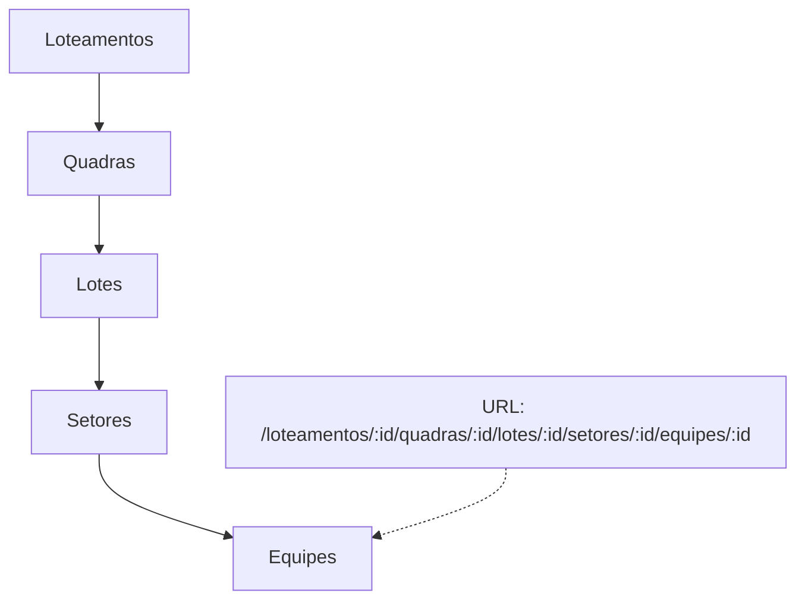

# Architecture Spine — Drill-down Dashboard (Epic 11)

## Design Paradigm

**Hierarchical nested state + Deep linked routes.** O roteamento e o banco de dados espelham a hierarquia de 5 níveis exatamente. O estado de navegação é capturado diretamente na URL (GoRouter path parameters), permitindo navegação profunda imediata e recuperação de breadcrumbs sem depender de estado em memória. No Firestore, a hierarquia é mapeada através de subcoleções diretas, garantindo escalabilidade na divisão de acesso (ACL).



## Invariants & Rules

### AD-1 — Hierarquia Firestore Aninhada

- **Binds:** Firestore schema, models
- **Prevents:** consultas planas ineficientes e perda de parentesco hierárquico na deleção.
- **Rule:** O esquema base deve seguir subcoleções estritas para acomodar os 5 níveis: `loteamentos/{idLoteamento}/quadras/{idQuadra}/lotes/{idLote}/setores/{idSetor}/equipes/{idEquipe}`. O conceito genérico de `Obras` será adaptado para a raiz desta hierarquia.

### AD-2 — Rotas de Drill-down Modulares (GoRouter)

- **Binds:** `app_router.dart`, feature routes
- **Prevents:** ausência de contexto de URL para deep-linking nos 5 níveis (impossibilitando F5 e links diretos).
- **Rule:** As rotas devem seguir a hierarquia estrita da estrutura organizacional: `/loteamentos/:lId/quadras/:qId/lotes/:loId/setores/:sId/equipes/:eId`. Isso substitui o paradigma anterior de acesso raso por obra.

### AD-3 — Atribuição de permissões (ACL) baseada no nó

- **Binds:** RH, Gestão de Membros, `firestore.rules`
- **Prevents:** modelo de permissão "tudo ou nada" restrito apenas à raiz da Obra.
- **Rule:** A atribuição de um operário/admin (Epic 8, 9, 10) agora ocorre em um nível específico da hierarquia (ex: atribuído à Quadra A). A validação (Rules) deve permitir leitura local e propagar restrições corretamente.

## Inherited Invariants
- `AD-1 (Modularização do Router)`: Uma lista de rotas por feature. As rotas dos 5 níveis ainda são compostas via `spread` no `app_router.dart`.
- `AD-1 (Gestão de Membros)`: Escrita de vínculos somente via Function.

## Structural Seed

O schema do Firestore agora assume o seguinte formato base sob a construtora:

```text
/construtoras/{cId}
  /loteamentos/{lId}                  (Root context)
    /quadras/{qId}
      /lotes/{loId}
        /setores/{sId}
          /equipes/{eId}
```

As rotas no GoRouter espelharão este caminho exato para suportar UX de drill-down:
`/loteamentos/:lId/quadras/:qId/lotes/:loId/setores/:sId/equipes/:eId`

## Capability → Architecture Map

| Capability / Area | Lives in | Governed by |
|---|---|---|
| Deep linking de equipe | feature routes correspondentes e GoRouter params | AD-2 |
| Dados aninhados hierárquicos | Firestore subcollections | AD-1 |
| Atribuição Granular (Epic 8,9,10) | `Functions membership`, `firestore.rules` | AD-3 |

## Deferred
- Como agregar métricas ou custos totais da raiz (Loteamento) a partir de milhares de Lotes/Equipes (possivelmente necessita Cloud Functions de agregação ou rollup documents).
