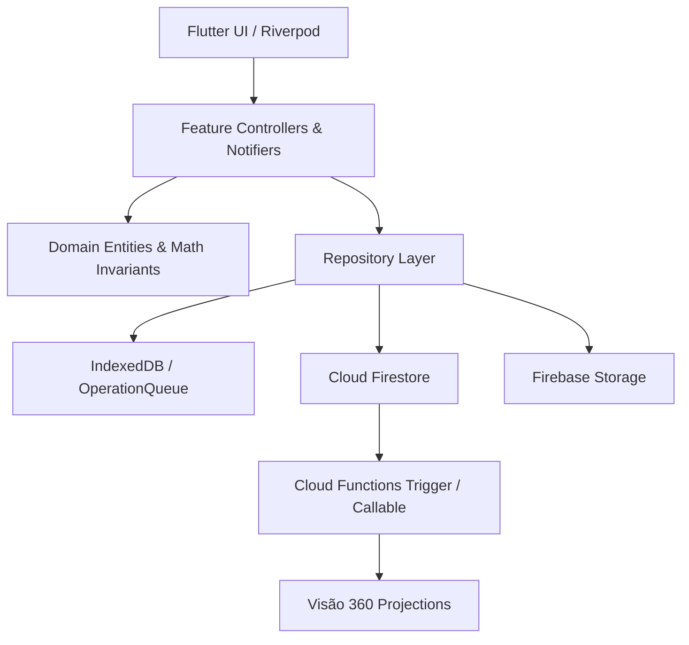
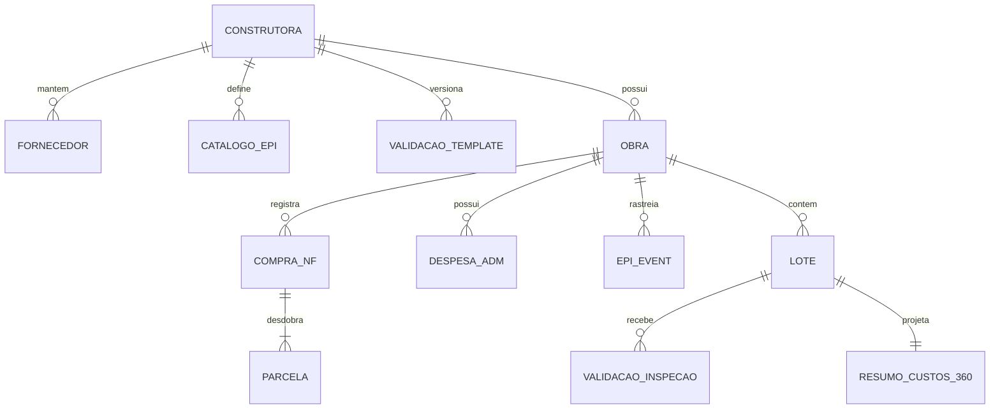

# Architecture Spine — Epic 5: Módulos Complementares e Visão 360º de Custos

## Design Paradigm

O Epic 5 adota o paradigma **Domain-Driven Layered Architecture** integrado a um modelo de **Projeções Analíticas Orientadas a Eventos (Event-Driven Projections)** para a consolidação da Visão 360º:
- **Presentation Layer (UI/Widgets):** Telas e componentes Flutter no padrão Riverpod ConsumerWidget/ConsumerStatefulWidget;
- **Application / Controller Layer:** Notifiers e use-cases orquestrando fluxos e validação síncrona de invariantes locais;
- **Domain / Service Layer:** Entidades puras, regras de negócio determinísticas e funções de agregação matemática monetária (precisão estrita em centavos);
- **Data / Infrastructure Layer:** Repositórios com suporte híbrido (Firestore remoto + cache local/IndexedDB para PWA offline) e Cloud Functions transacionais.



## Inherited Invariants

Restrições herdadas e mandatórias estabelecidas nos Epics 1 a 4:
- **RBAC Multiobra Determinístico:** Acesso baseado em `construtoras/{cId}/obras/{oId}/members/{uid}` com array `allowedModules`. Exceção confiável `dev_roles/{uid}` preservada;
- **Precisão Monetária Obrigatória:** Valores monetários são estritamente inteiros em centavos (`amountCents`). Fator de arredondamento proibido;
- **Offline-First & Auditoria:** Operações em canteiro usam fila local (`OperationQueue`) com persistência no IndexedDB; evidências fotográficas e termos utilizam Storage privado com carimbo auditável e hash SHA-256;
- **Imutabilidade Contábil:** Registros confirmados (chamadas de RH, saídas de estoque, despesas liquidadas) não sofrem exclusão física (`allow delete: if false;`).

## Architecture Decisions

### AD-1 — Estrutura de Domínios do Epic 5
* **Binds:** Toda a implementação de código dos novos módulos e telas.
* **Prevents:** Acoplamento monolítico entre módulos operacionais e espalhamento de lógica contábil.
* **Rule:** A pasta `app/lib/src/features/` recebe novos subpacotes isolados por domínio:
  - `features/fornecedores/` (catálogo corporativo compartilhado);
  - `features/epi/` (catálogo de EPIs, controle de C.A., eventos de distribuição e termos);
  - `features/validacao/` (templates dinâmicos de inspeção, checklists de lotes e pendências);
  - `features/despesas_adm/` (contas a pagar da obra, upload de PDFs e controle de liquidação);
  - `features/compras_parcelas/` (entrada de NFs e desdobramento em parcelas);
  - `features/custos_360/` (painel analítico consolidado e relatórios matriciais).

### AD-2 — Fornecedores como Entidade Corporativa Unificada
* **Binds:** Story `5-4-fornecedores` e suas referências em Almoxarifado (Epic 3) e ADM/Compras (Epic 5).
* **Prevents:** Redundância de cadastro de fornecedores por obra e divergência de dados cadastrais/fiscais na mesma construtora.
* **Rule:** Fornecedores residem na raiz da construtora: `construtoras/{cId}/fornecedores/{fornecedorId}`. 
  - Todo documento deve conter CNPJ ou CPF normalizado com validação de dígitos verificadores;
  - O acesso de leitura e vínculo é compartilhado entre todas as obras daquela construtora para membros autorizados nos módulos `almoxarifado`, `adm` ou `compras`.

### AD-3 — Gestão de EPI com Rastreabilidade e Termos Imutáveis
* **Binds:** Story `5-1-modulo-epi`.
* **Prevents:** Fraude trabalhista, perda de histórico de proteção do colaborador e questionamentos em passivos jurídicos.
* **Rule:** 
  - O catálogo de EPIs é corporativo (`construtoras/{cId}/catalogo_epis/{epiId}`), exigindo número e validade do C.A. (Certificado de Aprovação);
  - Eventos de distribuição (`entrega`, `substituicao`, `devolucao`, `baixa`) são gravados como registros imutáveis na obra: `construtoras/{cId}/obras/{oId}/epi_events/{eventId}`, vinculados obrigatoriamente a `funcionarioId` (Epic 4);
  - O Termo de Responsabilidade digital assinado gera comprovante imutável no Storage (`construtoras/{cId}/obras/{oId}/epis/{funcionarioId}/{timestamp}_termo.pdf`), associando o hash SHA-256 do documento ao registro de auditoria.

### AD-4 — Validação e Qualidade com Templates Versionados e Evidências Carimbadas
* **Binds:** Story `5-2-modulo-validacao`.
* **Prevents:** Modificação retroativa de critérios de qualidade, vistorias sem evidência auditável e adulteração de fotos.
* **Rule:**
  - Templates de checklist residem em `construtoras/{cId}/validacao_templates/{templateId}` e possuem campo incremental `version`;
  - A validação do lote é registrada em `construtoras/{cId}/obras/{oId}/lotes/{loteId}/validacoes/{validacaoId}` fixando o `templateVersion` utilizado;
  - Fotos de evidência (obrigatórias em itens não-conformes) devem conter carimbo de evidência (watermark com lote, data/hora, coordenadas e inspetor) e armazenamento seguro com permissão privada.

### AD-5 — Invariante Algébrica de Parcelamento e Despesas ADM
* **Binds:** Story `5-3-modulo-adm` e `5-5-parcelas-recebimento`.
* **Prevents:** Furo contábil, divergência de centavos entre valor total da NF e parcelas a pagar, e liquidação em duplicidade.
* **Rule:**
  - Cada compra ou despesa desdobrada em $N$ parcelas DEVE obedecer rigorosamente à invariante matemática:
    $$\sum_{i=1}^{N} \text{parcela}[i].\text{amountCents} \equiv \text{totalDocumentoCents}$$
  - A validação dessa invariante ocorre de forma síncrona no cliente e transacional na Cloud Function / Rules;
  - A liquidação de parcelas exige registro de `dataPagamento`, `pagoPorUid` e hash idempotente para impedir pagamento duplo.

### AD-6 — Visão 360º de Custos: Modelo Matricial de Agregação
* **Binds:** Story `5-6-visao-360-custos`.
* **Prevents:** Consultas O(N) pesadas e inviáveis em tempo real no cliente sobre milhares de documentos históricos de materiais, chamadas de RH e despesas.
* **Rule:**
  - A Visão 360º adota **projeções agregadas materializadas por Lote**:
    `construtoras/{cId}/obras/{oId}/lotes/{loteId}/resumo_custos/consolidado`
  - A estrutura do resumo armazena quatro cubos independentes em centavos:
    1. `materiaisCents`: saídas e requisições do Almoxarifado alocadas ao lote;
    2. `maoDeObraCents`: custo efetivo de homem-dia/homem-hora das chamadas de RH fechadas;
    3. `despesasDiretasCents`: notas fiscais, medições e títulos alocados ao lote;
    4. `rateioIndiretoCents`: cota-parte proporcional dos custos gerais da obra alocada ao lote.
  - Atualização por gatilhos controlados (fechamento de chamada de RH, conclusão de saída de estoque e liquidação ADM) garantindo consistência eventual e leitura ultra-rápida na UI.

### AD-7 — Governança, Não-Exclusão e Trilha de Auditoria
* **Binds:** Todas as histórias do Epic 5.
* **Prevents:** Exclusão acidental ou maliciosa de dados fiscais e trabalhistas.
* **Rule:**
  - Nenhum registro com impacto financeiro ou legal (despesa, parcela, evento de EPI, inspeção concluída) pode ser deletado fisicamente (`allow delete: if false;`);
  - Retificações ou cancelamentos geram novos estados e exigem justificativa textual formal, preservando o snapshot original na coleção central `audit/`.

## Conventions

| Concern | Convention |
|---|---|
| **Nomenclatura de Campos Financeiros** | Terminar sempre com `Cents` (ex.: `amountCents`, `totalCents`, `saldoDevedorCents`). |
| **Identificadores e Chaves** | Padrão alfanumérico seguro `^[A-Za-z0-9_-]{1,128}$` validado pela helper `id()`. |
| **Identificação de Fornecedores** | Normalização de CPF (11 dígitos numéricos) e CNPJ (14 dígitos numéricos) sem pontuação no backend. |
| **Status de Liquidação** | Enum textual: `aberto`, `parcial`, `pago`, `cancelado`. |
| **Status de Validação de Lotes** | Enum textual: `pendente`, `aprovado`, `reprovado`, `reaberto`. |
| **Estrutura de Armazenamento Storage** | `construtoras/{cId}/obras/{oId}/{modulo}/{subpasta}/{filename}`. |

## Stack

| Componente | Tecnologia | Versão / Pin |
|---|---|---|
| Frontend Framework | Flutter (Web/PWA & Mobile) | 3.x |
| State Management & DI | `flutter_riverpod` | `^2.5.1` |
| Roteamento Declarativo | `go_router` | `^14.0.0` |
| Banco de Dados Principal | Cloud Firestore | `^5.0.0` |
| Armazenamento de Arquivos | Firebase Cloud Storage | `^12.0.0` |
| Funções Transacionais / Agregações | Cloud Functions (Node / TypeScript) | `firebase-functions v4.9.0` |
| Cache & Fila Offline | IndexedDB (Web) / SQLite (Mobile) | `OperationQueue` nativa SIGO |

## Structural Seed

### Topologia de Dados do Epic 5 (Firestore)



### Estrutura de Código Sugerida

```text
app/lib/src/features/
  fornecedores/
    data/fornecedores_repository.dart
    domain/fornecedor.dart
    presentation/fornecedores_list_screen.dart
  epi/
    data/epi_repository.dart
    domain/epi_item.dart
    domain/epi_event.dart
    presentation/epi_entrega_screen.dart
  validacao/
    data/validacao_repository.dart
    domain/validacao_template.dart
    domain/checklist_item.dart
    presentation/checklist_lote_screen.dart
  despesas_adm/
    data/despesas_adm_repository.dart
    domain/despesa_adm.dart
    presentation/despesas_form_screen.dart
  compras_parcelas/
    data/compras_repository.dart
    domain/compra_nf.dart
    domain/parcela.dart
  custos_360/
    data/custos_360_repository.dart
    domain/custo_lote_360.dart
    presentation/visao_360_lote_screen.dart
```

## Capability → Architecture Map

| História / Capacidade | Onde reside | Governado por |
|---|---|---|
| **5.1 — Módulo EPI** | `app/lib/src/features/epi/` & `storage: epis/` | AD-1, AD-3, AD-7 |
| **5.2 — Módulo Validação** | `app/lib/src/features/validacao/` & `storage: validacao/` | AD-1, AD-4, AD-7 |
| **5.3 — Módulo ADM** | `app/lib/src/features/despesas_adm/` | AD-1, AD-5, AD-7 |
| **5.4 — Fornecedores** | `app/lib/src/features/fornecedores/` | AD-1, AD-2 |
| **5.5 — Parcelas e Compras** | `app/lib/src/features/compras_parcelas/` | AD-1, AD-5 |
| **5.6 — Visão 360º de Custos** | `app/lib/src/features/custos_360/` & Cloud Functions Projections | AD-1, AD-6 |

## Deferred

Decisões deliberadamente postergadas para manter o escopo enxuto e evitar overengineering prematuro:
1. **Integração Bancária Automática (Open Finance / CNAB 240/400):** A liquidação nesta fase é declaratória via comprovante/data, sem conexão direta com APIs de bancos;
2. **Importação XML / SPED Fiscal Automático:** Upload e extração OCR/XML de notas fiscais serão feitos manualmente ou por formulário assistido; parsing automático de XML de NF-e fica reservado para release subsequente;
3. **Assinatura Gov.br / ICP-Brasil para EPI:** Termos adotam validação por assinatura manuscrita na tela (canvas) ou confirmação biométrica/PIN com hash SHA-256 e auditoria interna do SIGO.
