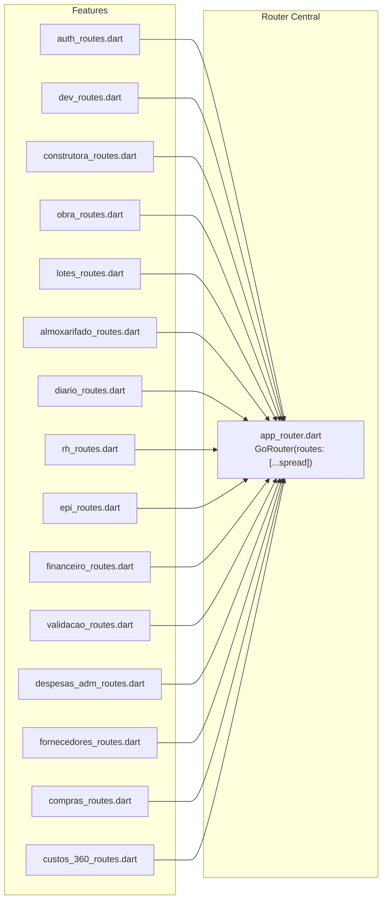
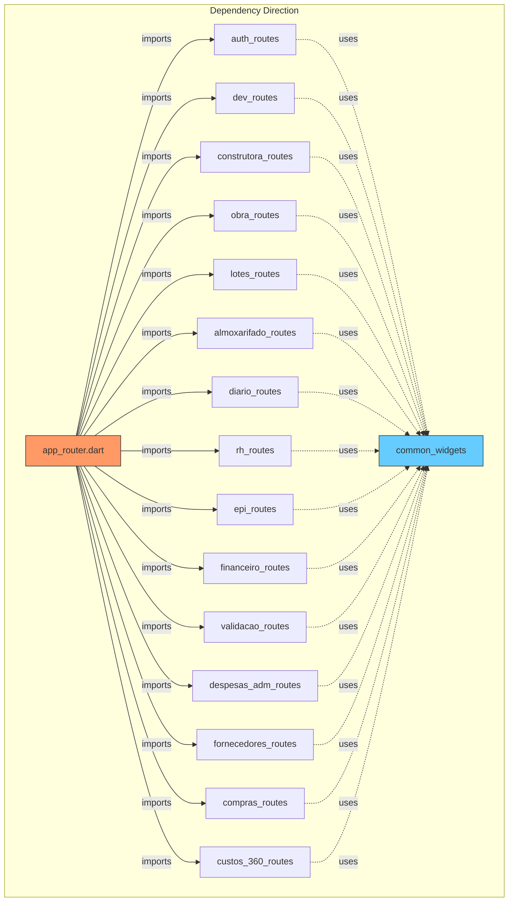

# Architecture Spine — Modularização do Router

## Design Paradigm

**Spread-composition over flat `List<RouteBase>` per feature.** Cada feature expõe uma lista top-level `List<RouteBase> get <feature>Routes` num arquivo `routing/<feature>_routes.dart` dentro da própria feature. O router central (`app_router.dart`) importa essas listas e as espalha (spread `...`) no `GoRouter.routes`. Nenhuma camada de abstração, registry, ou factory intermediária.



## Invariants & Rules

### AD-1 — Uma lista de rotas por feature [ADOPTED]

- **Binds:** all features
- **Prevents:** router monolítico crescendo com cada feature, conflitos de merge, imports cruzados massivos.
- **Rule:** cada feature expõe `List<RouteBase> get <feature>Routes` no arquivo `features/<feature>/routing/<feature>_routes.dart`. Nenhuma feature importa routing de outra feature; só o router central importa `*_routes.dart`.

### AD-2 — Spread-only composition

- **Binds:** `app_router.dart`
- **Prevents:** camada de abstração desnecessária sobre `go_router` e indirection que dificulta debugging.
- **Rule:** `app_router.dart` compõe via spread sem nesting, wrapper, ou factory: `routes: [...authRoutes, ...devRoutes, ...construtoraRoutes, ...]`.

### AD-3 — Redirect centralizado, AccessGuard por rota [ADOPTED]

- **Binds:** auth, dev guard, AccessGuard
- **Prevents:** cada feature implementando lógica de redirect divergente.
- **Rule:** `GoRouter.redirect` (auth + dev check) permanece centralizado em `routerProvider`; `AccessGuard` permanece no `builder` de cada rota dentro da feature. Nenhuma feature define seu próprio redirect.

### AD-4 — Path constants na feature

- **Binds:** all features
- **Prevents:** strings hardcoded espalhadas e typos de path.
- **Rule:** cada `*_routes.dart` define uma classe abstrata `<Feature>Paths` com constantes estáticas de path. Toda navegação (`context.go`, `context.push`) usa a constante da feature-alvo; nunca string literal de path fora do `*_routes.dart`.

### AD-5 — Imports isolados por feature

- **Binds:** all features
- **Prevents:** import circular entre features via routing.
- **Rule:** `*_routes.dart` importa apenas: (1) `package:go_router/go_router.dart`, (2) screens e domain da própria feature (relative imports), (3) `AccessGuard` de `common_widgets`. Nenhuma outra dependência.

### AD-6 — state.extra mantido inalterado [ASSUMPTION]

- **Binds:** almoxarifado (movimentação)
- **Prevents:** quebra de API durante a refatoração.
- **Rule:** rotas que usam `state.extra` com cast tipado mantêm o comportamento atual. Migração para path/query params é DEFERRED.

### AD-7 — Mapa feature → módulo de rotas

- **Binds:** all
- **Prevents:** feature sem rota definida ou rota órfã.
- **Rule:** toda rota pertence a exatamente uma feature. Mapa:

| Módulo de rota | Feature dir | Rotas |
|---|---|---|
| `authRoutes` | `authentication` | `/login` |
| `devRoutes` | `developer` | `/dev`, `/dev/users`, `/dev/users/:uid`, `/dev/construtoras` |
| `construtoraRoutes` | `construtoras` | `/`, `/construtora/:cId`, `/construtora/:cId/membros` |
| `obraRoutes` | `obras` | `/construtora/:cId/obra/:oId` |
| `lotesRoutes` | `lotes` | `…/lotes`, `…/lotes/novo` |
| `almoxarifadoRoutes` | `almoxarifado` | `/construtora/:cId/almoxarifado`, `…/novo_material`, `…/movimentacao` |
| `diarioRoutes` | `diario` | `…/diarios`, `…/diarios/novo`, `…/diarios/sync`, `/construtora/:cId/sync` |
| `rhRoutes` | `rh` | `/construtora/:cId/rh`, `…/funcionarios`, `…/funcionarios/novo`, `…/funcionarios/:fId/editar`, `…/obra/:oId/rh/chamadas`, `…/chamadas/nova`, `…/chamadas/:chId` |
| `epiRoutes` | `epi` | `/construtora/:cId/epis`, `…/obra/:oId/epis/entrega` |
| `financeiroRoutes` | `financeiro` | `/construtora/:cId/financeiro`, `…/financeiro/novo` |
| `validacaoRoutes` | `validacao` | `/construtora/:cId/validacao/templates`, `…/lotes/:loteId/validacoes`, `…/validacoes/nova`, `…/validacoes/:validacaoId` |
| `despesasAdmRoutes` | `despesas_adm` | `…/obra/:oId/despesas`, `…/despesas/nova`, `…/despesas/:despesaId`, `…/despesas/:despesaId/editar` |
| `fornecedoresRoutes` | `fornecedores` | `/construtora/:cId/fornecedores`, `…/fornecedores/novo`, `…/fornecedores/:fornecedorId/editar` |
| `comprasRoutes` | `compras_parcelas` | `…/obra/:oId/compras`, `…/compras/nova`, `…/compras/:compraId`, `…/compras/:compraId/editar` |
| `custos360Routes` | `custos_360` | `…/obra/:oId/custos-360`, `…/custos-360/lotes/:loteId` |



## Consistency Conventions

| Concern | Convention |
|---|---|
| Naming — arquivo | `features/<feature>/routing/<feature>_routes.dart` |
| Naming — getter | `List<RouteBase> get <feature>Routes` (top-level getter, camelCase da feature) |
| Naming — paths | classe abstrata `<Feature>Paths` com `static const String` por rota |
| Data & formats | paths sempre começam com `/`; parâmetros mantêm nome existente (`:cId`, `:oId`, `:fId`, etc.) |
| State & cross-cutting | `routerProvider` permanece `Provider<GoRouter>` com Riverpod; sem provider por feature de routing |
| Ordenação no router | auth → dev → construtora → obra → features de obra (lotes, diario, rh, epi, …) → features de construtora (almoxarifado, financeiro, rh-construtora, validacao, fornecedores, compras, custos_360, despesas_adm) |

## Stack

| Name | Version |
|---|---|
| go_router | ^18.0.1 |
| flutter_riverpod | ^3.4.3 |
| Dart SDK | ^3.13.2 |

## Structural Seed

```text
app/lib/src/
  routing/
    app_router.dart              # GoRouter + redirect + spread de todas as *Routes
  features/
    authentication/
      routing/
        auth_routes.dart         # authRoutes + AuthPaths
    developer/
      routing/
        dev_routes.dart          # devRoutes + DevPaths
    construtoras/
      routing/
        construtora_routes.dart  # construtoraRoutes + ConstrutoraPaths
    obras/
      routing/
        obra_routes.dart         # obraRoutes + ObraPaths
    lotes/
      routing/
        lotes_routes.dart        # lotesRoutes + LotesPaths
    almoxarifado/
      routing/
        almoxarifado_routes.dart # almoxarifadoRoutes + AlmoxarifadoPaths
    diario/
      routing/
        diario_routes.dart       # diarioRoutes + DiarioPaths
    rh/
      routing/
        rh_routes.dart           # rhRoutes + RhPaths
    epi/
      routing/
        epi_routes.dart          # epiRoutes + EpiPaths
    financeiro/
      routing/
        financeiro_routes.dart   # financeiroRoutes + FinanceiroPaths
    validacao/
      routing/
        validacao_routes.dart    # validacaoRoutes + ValidacaoPaths
    despesas_adm/
      routing/
        despesas_adm_routes.dart # despesasAdmRoutes + DespesasAdmPaths
    fornecedores/
      routing/
        fornecedores_routes.dart # fornecedoresRoutes + FornecedoresPaths
    compras_parcelas/
      routing/
        compras_routes.dart      # comprasRoutes + ComprasPaths
    custos_360/
      routing/
        custos_360_routes.dart   # custos360Routes + Custos360Paths
```

## Exemplos de Implementação (Seed)

### Exemplo: `rh_routes.dart`

```dart
import 'package:go_router/go_router.dart';
import '../../../common_widgets/access_guard.dart';
import '../presentation/funcionarios_list_screen.dart';
import '../presentation/funcionario_form_screen.dart';
import '../presentation/chamadas_list_screen.dart';
import '../presentation/chamada_form_screen.dart';
import '../domain/funcionario.dart';

abstract class RhPaths {
  static const rh = '/construtora/:cId/rh';
  static const funcionarios = '/construtora/:cId/rh/funcionarios';
  static const novoFuncionario = '/construtora/:cId/rh/funcionarios/novo';
  static String editarFuncionario(String cId, String fId) =>
      '/construtora/$cId/rh/funcionarios/$fId/editar';
  static const chamadas = '/construtora/:cId/obra/:oId/rh/chamadas';
  static const novaChamada = '/construtora/:cId/obra/:oId/rh/chamadas/nova';
  static String editarChamada(String cId, String oId, String chId) =>
      '/construtora/$cId/obra/$oId/rh/chamadas/$chId';
}

List<RouteBase> get rhRoutes => [
  GoRoute(
    path: RhPaths.rh,
    builder: (context, state) {
      final cId = state.pathParameters['cId']!;
      return AccessGuard(
        construtoraId: cId,
        module: 'rh',
        child: FuncionariosListScreen(construtoraId: cId),
      );
    },
  ),
  // ... demais rotas de RH
];
```

### Exemplo: `app_router.dart` (após refatoração)

```dart
import 'package:flutter_riverpod/flutter_riverpod.dart';
import 'package:go_router/go_router.dart';

import '../features/authentication/data/auth_repository.dart';
import '../features/authentication/data/user_repository.dart';

// Route modules
import '../features/authentication/routing/auth_routes.dart';
import '../features/developer/routing/dev_routes.dart';
import '../features/construtoras/routing/construtora_routes.dart';
import '../features/obras/routing/obra_routes.dart';
import '../features/lotes/routing/lotes_routes.dart';
import '../features/almoxarifado/routing/almoxarifado_routes.dart';
import '../features/diario/routing/diario_routes.dart';
import '../features/rh/routing/rh_routes.dart';
import '../features/epi/routing/epi_routes.dart';
import '../features/financeiro/routing/financeiro_routes.dart';
import '../features/validacao/routing/validacao_routes.dart';
import '../features/despesas_adm/routing/despesas_adm_routes.dart';
import '../features/fornecedores/routing/fornecedores_routes.dart';
import '../features/compras_parcelas/routing/compras_routes.dart';
import '../features/custos_360/routing/custos_360_routes.dart';

final routerProvider = Provider<GoRouter>((ref) {
  final authState = ref.watch(authStateChangesProvider);
  final devState = ref.watch(trustedDevProvider);

  return GoRouter(
    initialLocation: '/',
    redirect: (context, state) {
      // ... auth + dev redirect logic unchanged
    },
    routes: [
      ...authRoutes,
      ...devRoutes,
      ...construtoraRoutes,
      ...obraRoutes,
      ...lotesRoutes,
      ...almoxarifadoRoutes,
      ...diarioRoutes,
      ...rhRoutes,
      ...epiRoutes,
      ...financeiroRoutes,
      ...validacaoRoutes,
      ...despesasAdmRoutes,
      ...fornecedoresRoutes,
      ...comprasRoutes,
      ...custos360Routes,
    ],
  );
});
```

## Deferred

- **Migração `state.extra` → path/query params:** rotas de almoxarifado/movimentacao usam `state.extra` tipado; migrar quando deep linking for necessário.
- **go_router_builder code generation:** path constants manuais bastam agora; adotar se a quantidade de rotas crescer significativamente.
- **ShellRoute / StatefulShellRoute:** layout persistente (bottom nav, sidebar) não existe hoje; decisão adiada até que UX determine.
- **Route-level middleware pattern:** hoje `AccessGuard` no builder é suficiente; se lógica de guard se complexificar, considerar `redirect` por rota ou middleware pattern.
- **Testes de routing:** cobertura de testes unitários para cada `*_routes.dart`; adiado para sprint separado.
