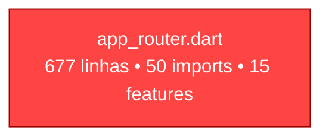
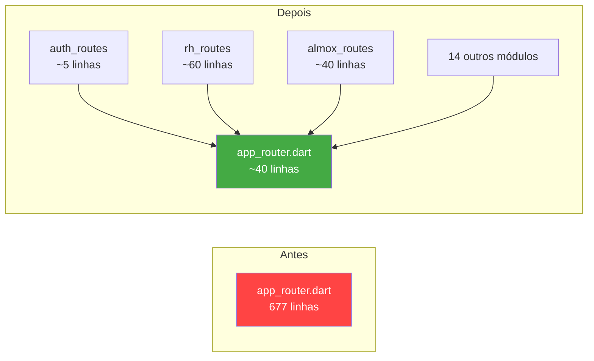
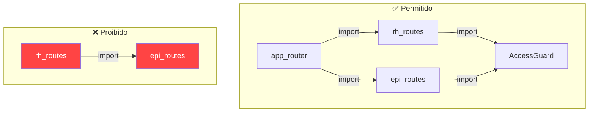
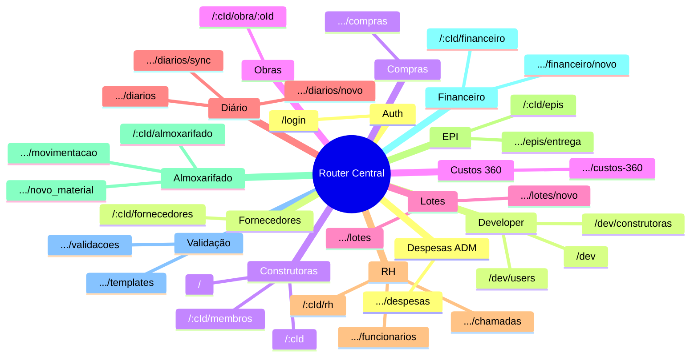

# 🏗️ Modularização do Router — Visão para o Time

## O Problema

O `app_router.dart` hoje tem **677 linhas** com **~50 rotas** num único arquivo. Todos os imports de todas as features convergem nele.



**Consequências:**
- ⚠️ Conflitos de merge frequentes (todos tocam o mesmo arquivo)
- ⚠️ Tempo de revisão alto (difícil localizar a mudança relevante)
- ⚠️ Acoplamento: qualquer nova tela = modificar o router central
- ⚠️ Um único import errado quebra tudo

---

## A Solução

Cada feature exporta suas próprias rotas. O router central apenas **compõe via spread**.



---

## Regra de Ouro

> **Nenhuma feature importa routing de outra feature.**
> Só o router central importa os `*_routes.dart`.



---

## Mapa de Módulos



---

## Estrutura de Arquivos

```text
features/
  rh/
    data/
    domain/
    presentation/
    routing/          ← NOVO
      rh_routes.dart  ← exporta rhRoutes + RhPaths
  epi/
    data/
    domain/
    presentation/
    routing/          ← NOVO
      epi_routes.dart ← exporta epiRoutes + EpiPaths
  ... (mesmo padrão para todas as 15 features)
```

---

## O que NÃO muda

| Item | Status |
|---|---|
| `AccessGuard` | ✅ Permanece no `builder` de cada rota |
| Redirect de auth/dev | ✅ Permanece centralizado no `routerProvider` |
| Paths das URLs | ✅ Exatamente os mesmos |
| `state.extra` (almoxarifado) | ✅ Mantido inalterado |
| Riverpod providers | ✅ Sem mudança |

---

## Exemplo: antes vs depois (RH)

````carousel
### Antes (em app_router.dart)
```dart
// ... 30 imports de outras features acima ...
import '../features/rh/presentation/funcionarios_list_screen.dart';
import '../features/rh/presentation/funcionario_form_screen.dart';
import '../features/rh/domain/funcionario.dart';
import '../features/rh/presentation/chamadas_list_screen.dart';
import '../features/rh/presentation/chamada_form_screen.dart';
// ... 20 imports de outras features abaixo ...

// Em routes: [ ... 50 GoRoute() ... ]
GoRoute(
  path: '/construtora/:cId/rh',
  builder: (context, state) { /* ... */ },
),
// ... misturado com rotas de todas as features
```
<!-- slide -->
### Depois (em rh/routing/rh_routes.dart)
```dart
import 'package:go_router/go_router.dart';
import '../../../common_widgets/access_guard.dart';
import '../presentation/funcionarios_list_screen.dart';
import '../presentation/funcionario_form_screen.dart';
import '../domain/funcionario.dart';
import '../presentation/chamadas_list_screen.dart';
import '../presentation/chamada_form_screen.dart';

abstract class RhPaths {
  static const rh = '/construtora/:cId/rh';
  static const funcionarios = '/construtora/:cId/rh/funcionarios';
  // ...
}

List<RouteBase> get rhRoutes => [ /* só rotas de RH */ ];
```
<!-- slide -->
### app_router.dart (resultado final)
```dart
import '../features/rh/routing/rh_routes.dart';
// ... 14 outros imports de routing ...

final routerProvider = Provider<GoRouter>((ref) {
  // redirect inalterado
  return GoRouter(
    routes: [
      ...authRoutes,
      ...rhRoutes,
      ...epiRoutes,
      // ... spread de cada módulo
    ],
  );
});
```
````

---

## Pontos de Atenção (ASSUMPTIONS)

> [!WARNING]
> Estes pontos foram assumidos e precisam de validação do time:

1. **custos_360 é módulo separado de despesas_adm** — mesmo que ambos usem `module: 'adm'` no AccessGuard
2. **Sem go_router_builder** — path constants manuais bastam por ora
3. **state.extra em almoxarifado** — mantido como está; migração para path params é adiada
