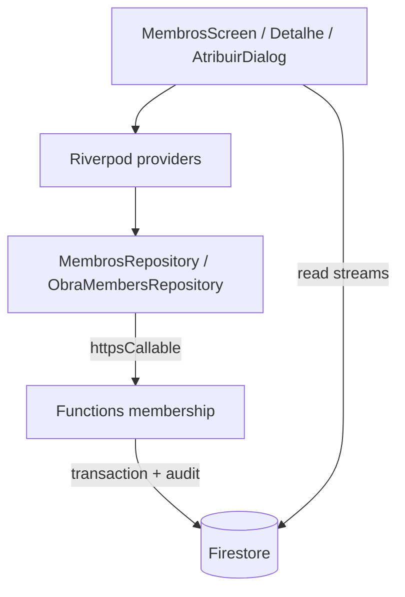
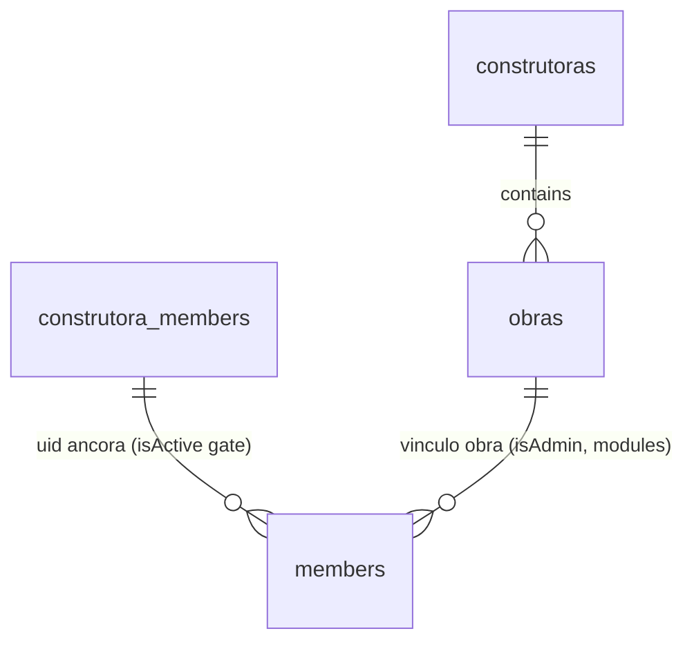

# Architecture Spine — Gestão de Membros

## Design Paradigm

Layered Riverpod MVVM + server-authoritative membership. UI (presentation/providers) nunca escreve `members` direto; `MembrosRepository`/`ObraMembersRepository` chamam `setMembership`/`setConstrutoraRole` (httpsCallable); Functions + `authority()` + `firestore.rules` são a autoridade.



## Invariants & Rules

### AD-1 — Escrita só via Function [ADOPTED]

- **Binds:** all
- **Prevents:** dois caminhos de escrita divergindo (client-write vs Function) e bypass de `authority`.
- **Rule:** toda mutação de `construtora_members` e `obras/{o}/members` passa por `setMembership`/`setConstrutoraRole` com `{construtoraId, obraId?, role, modules, isActive, email|userId}`; `firestore.rules` mantém `allow write: if dev()` nesses paths.

### AD-2 — adm e owner atribuem operário [ADOPTED]

- **Binds:** atribuicao-obra
- **Prevents:** UI escondendo ação do owner ou backend negando owner.
- **Rule:** `admin(c) = dev || manager(cm ativo)` e `obraAdmin = admin(c) || (cm ativo && manager(om))` onde `manager = isAdmin||isOwner||role admin/owner`; com `obraId`, exigir `obraAdmin`; sem `obraId`, exigir `admin(c)`. UI expõe Atribuir para `isAdmin||isOwner`.

### AD-3 — Papel de obra sem owner

- **Binds:** atribuicao-obra
- **Prevents:** enviar `owner` com `obraId` e receber `Papel inválido`.
- **Rule:** UI oferece só `Operário→operario` e `Admin da obra→admin`; leitura normaliza `member→Operário`; nunca enviar `owner` com `obraId`.

### AD-4 — Módulos canônicos + fail-closed

- **Binds:** atribuicao-obra
- **Prevents:** módulos legados (`rdo`, `almoxarifado`) e acesso implícito divergindo entre Functions e Rules.
- **Rule:** obra aceita `diario,lotes,estoque`; construtora aceita `estoque`; normalizar via `moduleName` na escrita e na leitura; `[]` = sem acesso; default UI `diario` sem presumir no backend.

### AD-5 — Filtro Por obra agrega no cliente (P1 validado)

- **Binds:** gestao-membros lista
- **Prevents:** `collectionGroup(members)` quebrando Rules ou vazando escopo.
- **Rule:** `Todos` = `watchMembros(c)` + `watchPendingRequests(c)`; `Por obra` = N `watchObraMembers(c,o)` das obras ativas + junção em memória (`uid→[obras]`); busca filtra email/displayName local. Leitura amparada por `rules:45,99,199` (admin lê tudo).

### AD-6 — Sem fila offline para vínculo (P4 validado)

- **Binds:** atribuicao-obra escrita
- **Prevents:** vínculo fantasma offline e `authorization_rejected` com retry infinito.
- **Rule:** leitura pode usar cache; escrita exige conectividade; sem `operationId`/enqueue; erro de rede mantém dialog aberto com `Sem conexão — tente novamente`.

### AD-7 — Desativação sem cascata transacional (P2 validado)

- **Binds:** remover/desativar
- **Prevents:** transação gigante varrendo obras e divergência entre limpeza física e revogação lógica.
- **Rule:** revogação efetiva é imediata via gate `active(cm)` em `authority().can` e `rules:member/obraMember`; UI executa `Remover de N obras` como N `setMembership{obraId,isActive:false}` + `setMembership{isActive:false}` na construtora; docs órfãos ativos são inócuos até limpeza.

### AD-8 — Owner só dev (P5 validado)

- **Binds:** gestao-membros detalhe
- **Prevents:** admin criando outro owner e lockout de propriedade.
- **Rule:** trocar `operario↔admin` (construtora e obra) liberado para admin/owner; criar/alterar `owner` exige `dev` (backend `index.ts:96`); UI esconde opção `owner` sem `trustedDev`.

### AD-9 — Pré-requisito vínculo construtora

- **Binds:** atribuicao-obra
- **Prevents:** obra-member sem lastro na construtora.
- **Rule:** exigir `construtora_members/{uid}.isActive==true` antes de `obraId` (backend `failed-precondition`); UI bloqueia com aviso inline + atalho `Ativar`.

## Consistency Conventions

| Concern | Convention |
|---|---|
| Naming | `watchMembros(c)`, `watchObraMembers(c,o)`, `watchObrasDoMembro(c,uid)`; `ObraMembersRepository`; `AtribuirObraDialog`; providers `membrosProvider(c)`, `obraMembersProvider((c,o))`, `obrasDaConstrutoraProvider(c)` |
| Data & formats | ids `^[A-Za-z0-9_-]{1,128}$`; datas Firestore `Timestamp` (leitura tolera ISO legado via `compatibleDates`); erro Function mapeado pt-br (`permission-denied`, `failed-precondition`, `Papel inválido`, `unavailable`) |
| State & cross-cutting | Riverpod `StreamProvider.autoDispose.family`; após mutação invalidar `membrosProvider` + `obraMembersProvider`; rota `/construtora/:cId/membros` com `AccessGuard(adminOnly:true)`; auditoria só servidor (`audit` collection, sem UI nesta etapa) |
| Erros | `permission-denied→Você não tem permissão.`; `failed-precondition→Ative na construtora primeiro.`; `Papel inválido→Use Operário ou Admin da obra.` |

## Stack

| Name | Version |
|---|---|
| Dart SDK (Flutter) | ^3.13.2 |
| flutter_riverpod | ^3.4.3 |
| cloud_firestore | ^6.10.0 |
| cloud_functions | ^6.5.0 |
| firebase_auth | ^6.7.0 |
| functions Node | 20 |
| firebase-admin | ^12.1.0 |
| firebase-functions | ^5.0.0 |

## Structural Seed

```text
app/lib/src/features/construtoras/presentation/  # MembrosScreen, MemberDetalheSheet, AtribuirObraDialog
app/lib/src/features/construtoras/data/           # MembrosRepository (construtora + pending)
app/lib/src/features/obras/data/                  # ObraMembersRepository (watchObraMembers, setMembership obra)
app/lib/src/features/obras/domain/                # ObraMember (userId,isAdmin,modules,joinedAt,isActive)
functions/src/                                    # index.ts membership, contracts.ts authority/manager
```



## Capability → Architecture Map

| Capability / Area | Lives in | Governed by |
|---|---|---|
| Listar membros + pendentes | `MembrosScreen`, `MembrosRepository.watchMembros/watchPendingRequests` | AD-1, AD-5 |
| Detalhe + N obras | `MemberDetalheSheet`, `ObraMembersRepository.watchObrasDoMembro` | AD-5, AD-9 |
| Atribuir operário/admin à obra | `AtribuirObraDialog` → `setMembership{obraId,role,modules}` | AD-1, AD-2, AD-3, AD-4, AD-9 |
| Trocar papel/módulos obra | overflow `ObraVinculoRow` → `setMembership` | AD-3, AD-4, AD-8 |
| Remover obra / desativar construtora | confirm dialog → N `setMembership{isActive:false}` | AD-7 |
| Trocar cargo construtora (P5) | bloco vínculo → `setConstrutoraRole` (sem owner sem dev) | AD-8 |

## Deferred

- Auditoria visível na UI (só servidor nesta etapa; revisitar se compliance exigir).
- Busca server-side e paginação (cliente basta até ~centenas de membros; revisitar com volume).
- Cascata transacional backend ao desativar construtora (desnecessário enquanto gate `active(cm)` vigorar; revisitar se limpeza física virar requisito).
- Painel lateral desktop >1200px vs dialog (decisão UX detalhe; não bloqueia build).
- `member` vs `operario` legado em obra: normalizar em migração futura (hoje leitura trata como Operário).
