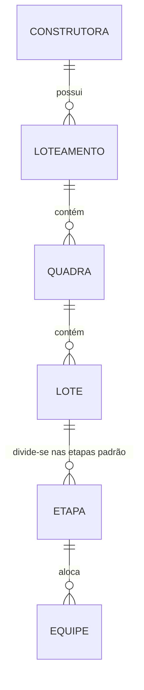

# Architecture Spine — Navegação Hierárquica Construtora

## Design Paradigm

**Declarative Routing & Flat Relational NoSQL**
A navegação e a UI são inteiramente dirigidas pela URL (via GoRouter), com cada nível hierárquico representado semânticamente no path. No banco de dados, em vez de aninhamento profundo (subcollections encadeadas) que dificulta paginação e consultas analíticas diretas, utilizaremos coleções de nível raiz no Firestore com chaves estrangeiras (reference ids).

## Invariants & Rules

### AD-1 — Modelo Relacional Flat no Firestore
- **Binds:** `CAP-2`, Data Layer, Firestore Schema
- **Prevents:** Consultas inviáveis para listar sub-entidades (ex: todas as Etapas de uma Construtora independentemente do Lote) e limites de profundidade do Firestore.
- **Rule:** As coleções (`loteamentos`, `quadras`, `lotes`, `etapas`, `equipes`) devem residir na raiz do Firestore (top-level collections). O relacionamento será feito através de campos de referência (ex: um documento na coleção `lotes` terá `quadraId`, `loteamentoId` e `construtoraId`).

### AD-2 — Rotas Declarativas Aninhadas Refletindo Hierarquia
- **Binds:** `CAP-1`, `CAP-2`, UI Layer, GoRouter
- **Prevents:** Estado de navegação fragmentado, onde a URL não reflete exatamente o nível em que o usuário está, impedindo deep-linking direto ou quebrando a semântica do botão "Voltar".
- **Rule:** A estrutura de rotas deve ser estritamente aninhada no GoRouter: `/construtoras/:cid/loteamentos/:lid/quadras/:qid/lotes/:ltid/etapas/:etid/equipes`. O state de carregamento (qual Lote exibir) deve ser derivado diretamente dos parâmetros da URL, e não de Singletons de estado global.

## Consistency Conventions

| Concern | Convention |
| --- | --- |
| Naming (entities) | Usar exclusivamente os termos unificados no domínio e código: `Loteamento`, `Quadra`, `Lote`, `Etapa`, `Equipe`. Abolir referências a `Obra` e `Setor`. |
| Data & formats (ids) | Usar IDs únicos gerados pelo Firestore (document IDs) ou UUIDv4. |
| Routing Pattern | Paths sempre no plural e em minúsculo: `/construtoras`, `/loteamentos`, `/quadras`, `/lotes`, `/etapas`, `/equipes`. |

## Stack

| Name | Version |
| --- | --- |
| Flutter / Dart | 3.x (Current) |
| go_router | Current |
| cloud_firestore | Current |

## Structural Seed

O esquema de dependências e relacionamento de entidades baseia-se num fluxo top-down (1:N):

## Capability → Architecture Map

| Capability / Area | Lives in | Governed by |
| --- | --- | --- |
| CAP-1 (Ver Loteamentos em vez de Obras) | UI / Router | AD-2, Conventions |
| CAP-2 (Drill-down estruturado) | UI / Data Layer | AD-1, AD-2 |

## Deferred

- **Conteúdo das Entidades:** Detalhes exatos de atributos extras, payload e metadados de cada entidade estão postergados. Essa Spine governa *como* as entidades se ligam estruturalmente e navegam, e não se a entidade `Equipe` possui uma foto de perfil, por exemplo.
- **Políticas de Cache:** Lógica de persistência offline está postergada para implementação futura, usando os defaults do Firestore por ora.
