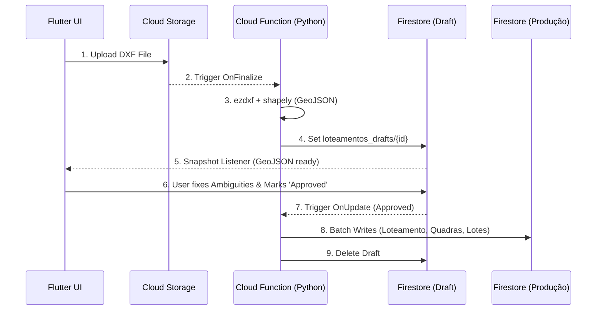

# Architecture Spine — Importação de DXF para Loteamentos

## Design Paradigm

**Async Pipeline & Immutable Drafts**
O processamento pesado ocorre de forma assíncrona no backend, gerando um estado intermediário imutável (Draft/Rascunho) que o cliente consome para revisão. Nenhuma mutação de inserção em massa ocorre diretamente do client.

## Inherited Invariants

| Inherited | From parent | Binds here |
| --- | --- | --- |
| AD-1 (Modelo Relacional Flat no Firestore) | architecture-obras-2026-09-24 | O resultado final do import não pode ser aninhado. Devem ser gravados em coleções raízes. |
| AD-2 (Rotas Declarativas Aninhadas) | architecture-obras-2026-09-24 | As rotas da UI de revisão devem respeitar a taxonomia do GoRouter. |

## Invariants & Rules

### AD-3 — Parser Boundary and Stack

- **Binds:** Data Import Pipeline
- **Prevents:** Thread-blocking heavy geometry math in Flutter Web and reliance on immature Dart CAD libraries.
- **Rule:** O parsing do DXF e os cálculos matemáticos complexos de *Point-in-Polygon* devem ocorrer exclusivamente no backend utilizando uma Cloud Function em Python com bibliotecas `ezdxf` e `shapely`. O output deve ser um `GeoJSON` limpo.

### AD-4 — State Mutation and Async Flow

- **Binds:** Import Flow, UI State
- **Prevents:** HTTP timeouts em arquivos grandes e perda de progresso caso a interface feche (UI unmount).
- **Rule:** O Flutter deve fazer upload do DXF diretamente para o Cloud Storage. Isso acionará uma Background Cloud Function que fará o processamento e salvará o GeoJSON em uma coleção temporária `loteamentos_drafts` no Firestore. O Flutter apenas escuta as mudanças deste documento.

### AD-5 — Ambiguity Resolution and Ingestion

- **Binds:** Data Import Pipeline, UI State
- **Prevents:** Client-side transaction failures and UI freezing during massive batch writes (Firestore 500-write limit).
- **Rule:** O backend aplicará heurísticas iniciais (ex: remover textos como "Área" ou "Casa") para parear Lotes. Lotes sem identificação clara recebem `"status": "ambiguo"` no GeoJSON para o usuário corrigir na UI. Ao aprovar, a UI não realiza gravações; ela delega ao backend a responsabilidade de executar os *batch writes* nas coleções finais (`loteamentos`, `quadras` e `lotes`) e apagar o rascunho.

## Consistency Conventions

| Concern | Convention |
| --- | --- |
| Naming (entities) | Os rascunhos viverão na coleção raiz temporária: `loteamentos_drafts`. |
| Data & formats | O Payload de comunicação UI/Backend será estruturado em formato estrito **GeoJSON**, contendo as propriedades estendidas `tipo` (quadra/lote), `nome`, e `status`. |
| State & cross-cutting | A persistência final segue a regra AD-1, lidando com os Foreign Keys (ex: criar o Loteamento, capturar o ID auto-gerado, repassar às Quadras e Lotes em transação). |

## Stack

| Name | Version |
| --- | --- |
| Python (Cloud Functions Gen 2) | 3.11+ |
| ezdxf (Python) | Current |
| shapely (Python) | Current |
| Flutter / Dart | 3.x (Current) |

## Structural Seed

O fluxo de dados da importação opera conforme a topologia abaixo:

## Capability → Architecture Map

| Capability / Area | Lives in | Governed by |
| --- | --- | --- |
| DXF Parsing / Point-in-Polygon | Backend (Cloud Function) | AD-3 |
| Import State / Upload | Cloud Storage + Firestore | AD-4 |
| Ambiguity Resolution & Ingestion | Backend + Flutter UI | AD-5, AD-1 |

## Deferred

- **GeoJSON Map Styling:** O detalhamento visual exato (cores, interações de clique, pins) do mapa na interface Flutter durante a aprovação fica postergado para a fase de UX/Design.
- **Formato Final dos Metadados Extraídos:** A necessidade de gravar a "área" bruta de cada lote (já calculada no shapely) além das coordenadas no banco final será definida na Especificação (SPEC).
