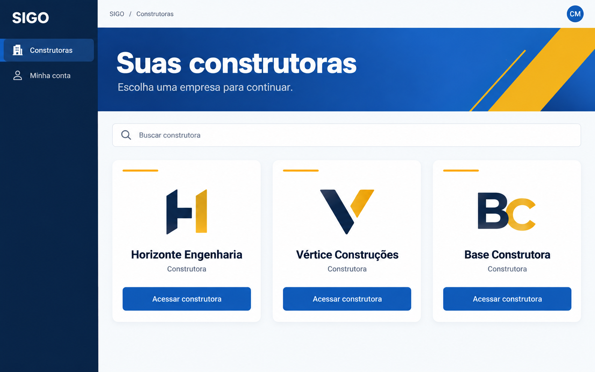
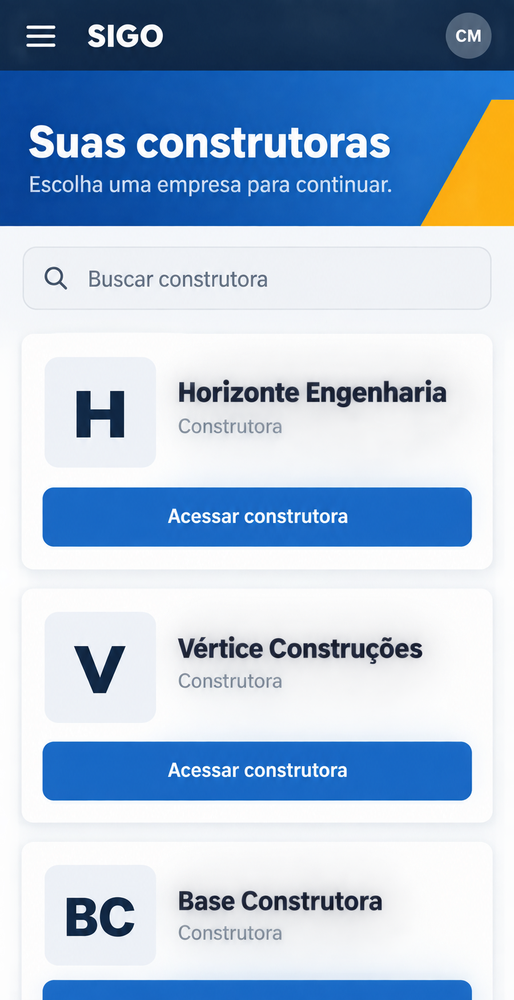
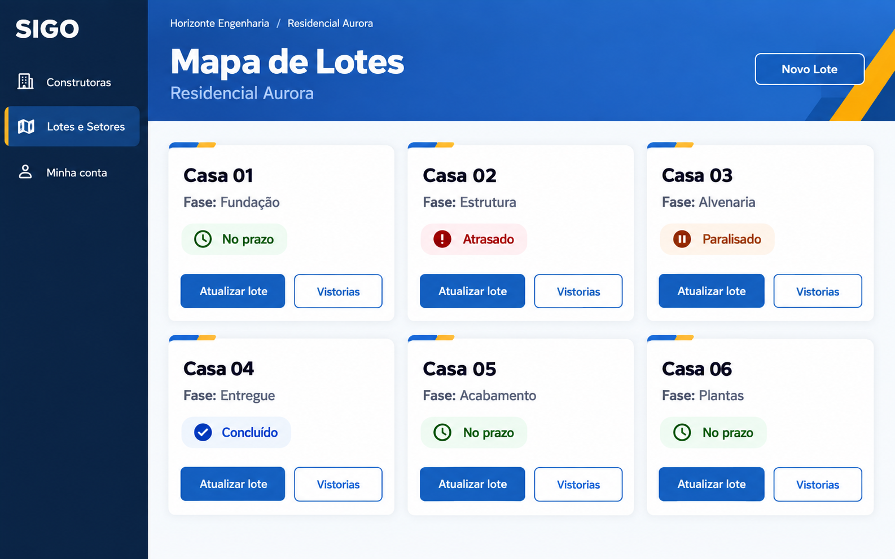
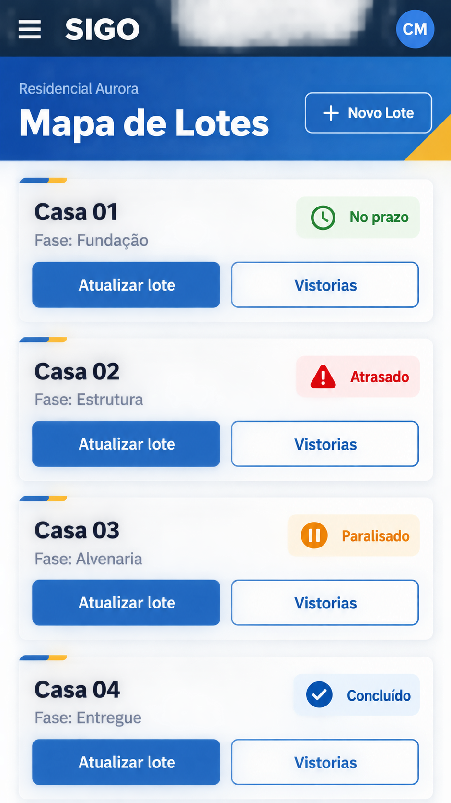

# Prévias refinadas — ImageGen integrado

Imagens conceituais para discussão. Dados fictícios; wordmark textual ocupa temporariamente o lugar da logo oficial. DESIGN.md e EXPERIENCE.md prevalecem sobre variações de cores, tipografia e medidas nas imagens. Nenhum código implementado.

## construtoras-desktop

Prompt:

Use case: ui-mockup. Generate a polished high fidelity SIGO construction management app design preview. Brazilian Portuguese, impeccable readable text, contemporary Material sans-serif typography, strong 700 headings and 600 card names. Flat front-facing screenshot, no perspective or physical device frame. Consistent expressive premium blue/gold identity: sidebar #082344, white text, header gradient #0D47A1 to #1565C0 with white heading, restrained geometric golden accent #FCA906, canvas #F8FAFC, white cards, ink #0F172A, secondary ink #475569, primary buttons #1565C0 white text. Rounded cards 12 logical px, soft shadows. Use plain 'SIGO' wordmark, do not invent a logo symbol or slogan. No photos, building pictures, fake charts, metrics, notifications or invented controls. Exact content and structure below. These are design proposals with fictional demo data. Landscape desktop 16:10. Sidebar 220px: SIGO, selected 'Construtoras', 'Minha conta'. Top breadcrumb 'SIGO / Construtoras' and avatar CM. Expressive header 'Suas construtoras', subtitle 'Escolha uma empresa para continuar.', gold geometric accent to right away from text. Search 'Buscar construtora'. Three SPACIOUS white cards in one row, 24px padding, 24px gutters, generous 88px logo zone. Cards: 'Horizonte Engenharia' with tasteful fictional H monogram; 'Vértice Construções' with V monogram; 'Base Construtora' with simple BC initials fallback. Each secondary text 'Construtora' and full-width blue 'Acessar construtora' button. Names approx20px semibold, heading40px bold. Large visual breathing room, cards about320px wide, gold slender upper accents. No CNPJ numbers invented.

## construtoras-mobile

Prompt:

Use case: ui-mockup. Generate a polished high fidelity SIGO construction management app design preview. Brazilian Portuguese, impeccable readable text, contemporary Material sans-serif typography, strong 700 headings and 600 card names. Flat front-facing screenshot, no perspective or physical device frame. Consistent expressive premium blue/gold identity: sidebar #082344, white text, header gradient #0D47A1 to #1565C0 with white heading, restrained geometric golden accent #FCA906, canvas #F8FAFC, white cards, ink #0F172A, secondary ink #475569, primary buttons #1565C0 white text. Rounded cards 12 logical px, soft shadows. Use plain 'SIGO' wordmark, do not invent a logo symbol or slogan. No photos, building pictures, fake charts, metrics, notifications or invented controls. Exact content and structure below. These are design proposals with fictional demo data. Portrait mobile screenshot 9:19 ratio. 390 logical px viewport scaled crisply. Top navy bar hamburger, plain SIGO, avatar CM. Compact blue gradient heading area 'Suas construtoras' at28px bold, subtitle 'Escolha uma empresa para continuar.' gold accent at right. 16px page margins, search 'Buscar construtora'. Single column SPACIOUS white cards with20px internal padding and16px gaps. First 'Horizonte Engenharia' with H monogram in64px logo zone, secondary 'Construtora', full-width48px tall 'Acessar construtora' button. Second 'Vértice Construções' with V monogram, same structure. If space allows show top of third 'Base Construtora' BC initials at bottom as natural scroll continuation. Strong readable20px card names. No desktop sidebar, no bottom navigation, no oversized hero. All fully shown primary controls comfortable touch targets.

## lotes-desktop

Prompt:

Use case: ui-mockup. Generate a polished high fidelity SIGO construction management app design preview. Brazilian Portuguese, impeccable readable text, contemporary Material sans-serif typography, strong 700 headings and 600 card names. Flat front-facing screenshot, no perspective or physical device frame. Consistent expressive premium blue/gold identity: sidebar #082344, white text, header gradient #0D47A1 to #1565C0 with white heading, restrained geometric golden accent #FCA906, canvas #F8FAFC, white cards, ink #0F172A, secondary ink #475569, primary buttons #1565C0 white text. Rounded cards 12 logical px, soft shadows. Use plain 'SIGO' wordmark, do not invent a logo symbol or slogan. No photos, building pictures, fake charts, metrics, notifications or invented controls. Exact content and structure below. These are design proposals with fictional demo data. Landscape desktop screenshot16:10. Same navy sidebar style with SIGO and items 'Construtoras', 'Lotes e Setores' selected, 'Minha conta'. Context breadcrumb 'Horizonte Engenharia / Residencial Aurora'. Blue header 'Mapa de Lotes' 40px bold and subtitle 'Residencial Aurora', modest gold geometry. 'Novo Lote' outlined white button at right of blue header. Main content grid 3 columns x2 rows of COMPACT operational white cards about280-320px wide,16px padding/gutters,8px internal spacing, no logo areas or photos, no large empty area within cards. Six cards with exact content: 'Casa 01' 'Fase: Fundação' status 'No prazo'; 'Casa 02' 'Fase: Estrutura' status 'Atrasado'; 'Casa 03' 'Fase: Alvenaria' status 'Paralisado'; 'Casa 04' 'Fase: Entregue' status 'Concluído'; 'Casa 05' 'Fase: Acabamento' status 'No prazo'; 'Casa 06' 'Fase: Plantas' status 'No prazo'. Name18px semibold; phase14px. Status pill text+icon: green clock No prazo (#166534 on #F0FDF4); red alert Atrasado (#991B1B on #FEF2F2); orange pause Paralisado (#9A3412 on #FFF7ED); blue check Concluído (#1E40AF on #EFF6FF). Each footer two distinct48px-tall comfortable actions 'Atualizar lote' blue and 'Vistorias' outline, no duplicated action icons. Very small blue/gold brand accent on card top; never entire card colored by status. No progress percentage, costs, deadlines, photos or filters.

## lotes-mobile

Prompt:

Use case: ui-mockup. Generate a polished high fidelity SIGO construction management app design preview. Brazilian Portuguese, impeccable readable text, contemporary Material sans-serif typography, strong 700 headings and 600 card names. Flat front-facing screenshot, no perspective or physical device frame. Consistent expressive premium blue/gold identity: sidebar #082344, white text, header gradient #0D47A1 to #1565C0 with white heading, restrained geometric golden accent #FCA906, canvas #F8FAFC, white cards, ink #0F172A, secondary ink #475569, primary buttons #1565C0 white text. Rounded cards 12 logical px, soft shadows. Use plain 'SIGO' wordmark, do not invent a logo symbol or slogan. No photos, building pictures, fake charts, metrics, notifications or invented controls. Exact content and structure below. These are design proposals with fictional demo data. Portrait mobile screenshot9:19 ratio,390 logical px viewport. Top navy bar hamburger, SIGO and avatar CM. Compact blue gradient header with eyebrow 'Residencial Aurora', heading 'Mapa de Lotes'28px bold and small gold geometry. 'Novo Lote' visible outlined button.16px margins. Single column COMPACT white operational cards with16px padding,16px vertical gaps,8px internal spacing; no logos or images or decorative height. Show four cards as space allows, natural scrolling: 'Casa 01' 'Fase: Fundação' status 'No prazo'; 'Casa 02' 'Fase: Estrutura' status 'Atrasado'; 'Casa 03' 'Fase: Alvenaria' status 'Paralisado'; 'Casa 04' 'Fase: Entregue' status 'Concluído'. Names18px semibold and phase14px. Each card status text+icon: green clock, red alert, orange pause, blue check respectively on very pale matching badge backgrounds. Each card footer has two separate48px tall touch actions 'Atualizar lote' solid blue and 'Vistorias' outlined; labels readable and fit, no tiny targets. Tiny blue/gold card-top accent. No percentage, finance metrics, photos, date or filters. No desktop sidebar or bottom navigation. Dense content but comfortable readability, noticeably more compact than company selection screen.

