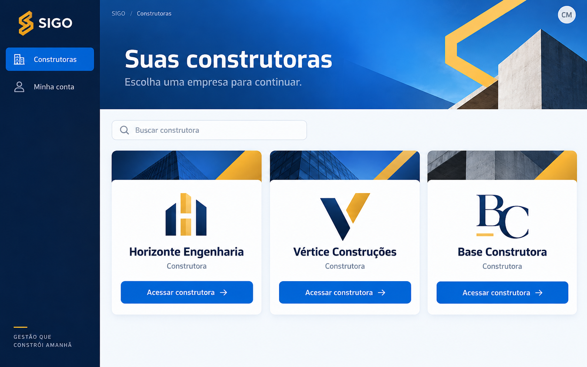

# SIGO — Experiência global, rascunho

## Foundation

Confirmado: direção desktop mais expressiva, representada pelo conceito B; paleta derivada da logo SIGO e do azul existente, cards de construtoras mais interessantes com possível logo da empresa, praticidade no telefone, design impressionante no desktop, apenas design/planejamento e preservação dos documentos existentes. Mobile + Web PWA e Flutter Material são heranças das fontes. [DESIGN.md](DESIGN.md) é a referência visual; este documento registra comportamento. `[ASSUMPTION]` identifica propostas a discutir.

A imagem orienta a composição da seleção de construtora: sidebar azul profundo, cabeçalho azul marcante, acentos dourados e cards claros com área de logo e ação azul. Não aprova novos recursos, slogan, empresas fictícias ou redesenho da logo oficial. O usuário também confirmou manter o contraste da imagem, títulos fortes, construtoras espaçosas e lotes compactos. Valores exatos de cores, tipografia e medidas são calibragem [ASSUMPTION] em DESIGN.md; as regras comportamentais abaixo mantêm suas hipóteses e pendências.

Escopo das evidências: Gestão de Membros (épicos 8–10) e módulos do épico 5. Não há inventário completo de telas ou pesquisa de usuários nessas fontes. Carla, Otávio, Carneiro e José vêm das jornadas de membros; os demais protagonistas abaixo são ilustrações sinalizadas. Não se presume que cargo profissional determina permissão.

## Information Architecture

[ASSUMPTION] Organizar o contexto em construtora → obra → tarefa/módulo, conservando o shell existente. A troca de obra precisa recalcular permissões antes de expor ações. A navegação global definitiva continua aberta; esta matriz contém somente superfícies sustentadas pelas fontes e suas propostas de composição.

| Superfície | Entrada/contexto | Jornada coberta | Telefone / desktop |
|---|---|---|---|
| Seleção de construtora | Lista de construtoras acessíveis | Escolher construtora | Card em coluna / grid adaptativo [ASSUMPTION] |
| Drill-down: Loteamento | Pós-login ou seleção | Visualizar Loteamentos da Obra/Construtora | [ASSUMPTION] Cards em coluna / grid adaptativo |
| Drill-down: Quadra | Seleção de Loteamento | Visualizar Quadras de um Loteamento | [ASSUMPTION] Cards em coluna / grid adaptativo |
| Drill-down: Lote | Seleção de Quadra | Visualizar Lotes de uma Quadra | [ASSUMPTION] Cards em coluna / grid adaptativo |
| Drill-down: Setor | Seleção de Lote | Visualizar Setores de um Lote | [ASSUMPTION] Cards em coluna / grid adaptativo |
| Drill-down: Equipe | Seleção de Setor | Visualizar Equipes do Setor | [ASSUMPTION] Cards em coluna / grid adaptativo |
| Editar lote | Card do lote | Identificar e atualizar lote | [ASSUMPTION] Sheet / dialog; preserva seletores existentes |
| Novo Lote | Ação na lista | Cadastrar lote | Formulário de nome, fase e status |
| Gestão de Membros | Rota restrita a admin/owner | Fluxos 1–3; stories 8.1–10.3 | Lista / lista com filtros |
| Detalhe do membro | Linha da lista | Fluxos 1–3 | Sheet / dialog; painel é hipótese |
| Atribuir à obra | Detalhe de membro ativo | Fluxos 1 e 3 | Formulário adaptado / dialog |
| Confirmação de gestão de vínculo | Ação no detalhe/obra | Fluxo 2; extensão de cargo/desativação | Consequência explícita em ambas |
| Módulo EPI | Obra, membro autorizado | 5.1 — Módulo EPI | Registro/evidência / consulta contextual [ASSUMPTION] |
| Módulo Validação | Lote e template | 5.2 — Módulo Validação | Inspeção sequencial / inspeção e contexto [ASSUMPTION] |
| Módulo ADM | Despesa da obra | 5.3 — Módulo ADM | Formulário / lista e detalhe [ASSUMPTION] |
| Fornecedores | Catálogo da construtora | 5.4 — Fornecedores | Busca e detalhe em ambas [ASSUMPTION] |
| Parcelas e Compras | Documento de compra | 5.5 — Parcelas e Compras | Resumo e parcelas / comparação de parcelas [ASSUMPTION] |
| Visão 360º de Custos | Obra e lote | 5.6 — Visão 360º de Custos | Síntese sequencial / composição matricial [ASSUMPTION] |

As entradas exatas das seis superfícies do épico 5 não foram narradas pelo usuário; a matriz não fecha a arquitetura de informação global. Diário e estoque aparecem nas permissões de membros, mas suas jornadas completas não estão nas fontes autorizadas desta rodada. A rodada de cards acrescenta inspeção local do modelo, lista e edição de lotes: [extrato](.working/lotes-extract.md). Não fecha as demais jornadas do módulo.

## Voice and Tone

Pt-br, frases diretas, alvo e consequência explícitos. Evitar códigos internos na interface. A voz visual está em DESIGN.md.

| Situação | Texto de referência |
|---|---|
| Vínculo confirmado | `Atribuído a {obra} como {papel}.` |
| Rede necessária em membros | `Sem conexão — tente novamente.` |
| Vínculo inativo | `Ative o membro na construtora antes de atribuir à obra.` |
| Permissão revogada | `Acesso removido.` |
| Salvamento local [ASSUMPTION] | `Salvo neste dispositivo. Aguardando sincronização.` |
| Custo ainda em atualização [ASSUMPTION] | `Custos em atualização.` — apenas se esse estado for conhecido |

“Sincronizado” só após confirmação correspondente. Se não houver horário confiável, não inventar “atualizado agora”.

## Component Patterns

Todos correspondem à tabela visual de DESIGN.md. Componentes genéricos são propostas de contrato [ASSUMPTION], não exigência de implementação.

| Componente | Regra comportamental |
|---|---|
| ConstrutoraCard | [ASSUMPTION] Toque/clique abre a construtora inteira; foco e nome acessível; logo não é ação separada. Ausente/erro de logo usa iniciais e preserva nome. Inclusão/edição de logo é possibilidade solicitada, sem mecanismo de upload aprovado. Não criar ações de gestão no card sem autorização |
| LoteCard | [ASSUMPTION] Área principal abre edição existente, identificada por Atualizar lote; Vistorias é ação independente que não dispara edição. Nome, fase e status são anunciáveis. Restaurar foco e posição ao retornar. Desktop pode usar dialog em vez do sheet atual; não inventar nova página de detalhe. Expor apenas ações autorizadas |
| SigoLayout | Preserva contexto; recalcula acesso ao trocar obra; não mantém ação habilitada por permissão de contexto anterior |
| ActionButton | Uma ação primária por tarefa [ASSUMPTION]; ocupado impede duplicação; desabilitado explica pré-condição |
| DataSurface | Busca/filtro conserva contexto; distingue sem registros de nenhum resultado; abrir detalhe mantém retorno ao ponto anterior [ASSUMPTION] |
| StatusFeedback | Estado persistente para fila/erro que exija ação; snackbar para confirmação transitória; rótulo diferencia dado em cache de escrita confirmada |
| FormField | Valida próximo ao campo; mantém entradas em falhas recuperáveis; não usa placeholder como único label |
| DetailOverlay | Foco entra no conteúdo relevante e retorna ao acionador; cancelar disponível; edição não se perde por fechamento acidental [ASSUMPTION] |
| MemberRow | Tap abre detalhe; pendente informa pedido e não simula membro ativo; leitor anuncia nome, cargo, N obras e estado |
| RoleChip | Rótulo traduz papel; não concede acesso nem funciona como seletor por si só |
| ObraVinculoRow | Menu troca papel/módulos ou remove com confirmação; apenas ações autorizadas |
| AtribuirObraDialog | Obra ativa obrigatória; padrão Operário e sugestão diario; módulos vazios significam sem acesso; confirmação depende de servidor |
| ConfirmDestructiveDialog | Nomeia alvo, alcance e preservação do histórico; não promete atomicidade em remoção de N obras |
| EvidenceField | [ASSUMPTION] Captura/anexo, prévia e envio separados; falha não apaga evidência local; foto obrigatória bloqueia conclusão de não conformidade |
| CostSummary | [ASSUMPTION] Explicita contexto e composição dos quatro custos; informa atualização quando disponível; ausência de dado não equivale a zero |

## State Patterns

Regra transversal [ASSUMPTION]: carga inicial apresenta estrutura ou progresso; foco permanece visível e ordenado; vazio explica próximo passo autorizado; erro recuperável conserva dados e oferece tentar novamente; sem permissão não repete tentativas indefinidamente. Um estado desconhecido deve ser declarado, não mascarado como sucesso.

| Superfícies | Carga, vazio e foco | Falha, offline e permissão |
|---|---|---|
| Seleção de construtora | Carga dos cards; vazio diferencia nenhum vínculo de erro; foco visível no card | Logo falha usa fallback; falha de lista tem retry; cache identificado se existir; revalidar acesso ao entrar [ASSUMPTION] |
| Mapa de Lotes | [ASSUMPTION] Carga sem status fictício; vazio explica nenhum lote e oferece Novo Lote somente se autorizado; foco na área de atualização e depois Vistorias | Erro com tentar novamente; preservar lista anterior se segura; identificar cache somente quando conhecido; não inferir atualização a partir de createdAt; revogação bloqueia ações |
| Editar lote | [ASSUMPTION] Identificação do lote, fase e status atuais; ocupado impede envio duplicado; foco volta ao card | Manter entradas em falha; reconhecer gravação parcial de fase/status; não anunciar sucesso completo ou sincronização sem evidência. Política offline por ação permanece aberta |
| Novo Lote | Nome obrigatório; fase e status selecionáveis; ocupado impede duplicação | [ASSUMPTION] Falha conserva formulário; sem autorização bloqueia envio; não prometer cadastro confirmado offline |
| Gestão de Membros | Skeleton de linhas; nenhum membro/nenhum resultado; foco em busca e filtros | Cache identificado se disponível; erro com retry; admin/owner apenas |
| Detalhe do membro | Progresso; nenhuma obra vinculada; foco na abertura | Falha conserva retorno; cache não autoriza mutação; acesso revogado encerra ação |
| Atribuir à obra | Carrega obras; nenhuma obra ativa bloqueia; obra → papel → módulos → confirmar | Rede obrigatória, sem fila; falha mantém dados; permission-denied tem conflito pendente entre fontes |
| Confirmação de gestão de vínculo | Alvo carregado; sem alvo não confirma; cancelar acessível | Mostra falha/resultado parcial sem declarar remoção total [ASSUMPTION]; exige confirmação servidor |
| Módulo EPI | Registro, catálogo e termo; vazio de catálogo impede seleção; foco sequencial [ASSUMPTION] | Operações de canteiro podem usar fila; assinatura/termo não são “confirmados” antes de evidência correspondente; política específica de cada ação pendente |
| Módulo Validação | Template/versionamento; sem template não inicia; foco por item [ASSUMPTION] | Evidência faltante/falha de envio explícita; fila operacional não elimina exigência de foto; acesso por módulo |
| Módulo ADM | Lista/formulário; sem despesa e filtro vazio distintos [ASSUMPTION] | Valores inválidos bloqueiam; confirmação financeira não presumida offline; política específica de liquidação pendente |
| Fornecedores | Busca/carregamento; vazio local diferente de cadastro inexistente [ASSUMPTION] | Validação documental e duplicidade precisam de feedback; cache não comprova catálogo completo; módulos autorizados |
| Parcelas e Compras | Documento e parcelas; sem documento não confirma [ASSUMPTION] | Soma divergente bloqueia; não anunciar pagamento sem confirmação; conflito/duplicidade conserva contexto |
| Visão 360º de Custos | Carga e ausência de projeção distintas de zero; foco por contexto/detalhe [ASSUMPTION] | Cache/atualização quando conhecidos; projeção é eventualmente consistente; erro não zera totais; acesso restrito |

Offline não é promessa uniforme: ARQ-M AD-6 proíbe fila em vínculos; ARQ-5 herda fila para operações de canteiro. Para cada ação nova, definir elegibilidade, evidência local, confirmação remota e recuperação antes de aprovar o fluxo.

## Interaction Primitives

[ASSUMPTION] Hover não movimenta os cards nem revela ações exclusivas; foco usa `{colors.focus-light}` em superfícies claras, `{colors.focus-sidebar}` na sidebar e `{colors.focus-header}` no cabeçalho, com separação do controle conforme DESIGN.md. Ocupado bloqueia duplicação sem remover o rótulo.

Toque/clique abre ou confirma; ações importantes não dependem de hover, long-press ou gesto oculto. Pull-to-refresh é herdado para membros. Teclado web: ordem lógica, foco em overlays, Esc fecha quando seguro e Enter confirma apenas formulário válido. [ASSUMPTION] Durante envio, anunciar progresso sem deslocar o foco.

Confirmar destrutivo mostra efeito real e histórico preservado; registros financeiros/legais confirmados usam retificação/cancelamento com justificativa, não exclusão física. Não generalizar remoção de membro como exclusão de registro de negócio.

## Accessibility Floor

Metas de projeto, sem declaração de conformidade: alvos ≥48dp; controles com nome, papel e estado; atualizações importantes anunciáveis; foco visível/restaurado; mensagens de erro associadas ao campo. Papel/status com ícone e texto. Contraste e limitações de bordas estão em DESIGN.md, usando `{colors.ink-primary}` e `{colors.ink-secondary}` para informação habilitada.

TextScale 1.3x é herança mínima de membros, não teto global. [ASSUMPTION] Projetar reflow e escala ampliada sem truncar ações; verificar posteriormente com teclado, leitores de tela e dispositivos reais. Redução de movimento respeitada; nenhuma animação necessária para compreender estado. No telefone, teclado e áreas seguras não cobrem confirmação.

## Responsive & Platform

[ASSUMPTION] Telefone privilegia uma tarefa e ordem sequencial; desktop conserva a mesma capacidade autorizada e reúne contexto útil. Isso não autoriza limitar funcionalidades essenciais no telefone.

[ASSUMPTION] Densidade por tipo de conteúdo: ConstrutoraCard usa `{spacing.constructor-padding-mobile}` / `{spacing.constructor-padding-desktop}` e área de logo; LoteCard usa `{spacing.lot-padding}` e `{spacing.lot-gap}`, sem reservar uma área decorativa equivalente. Os dois preservam alvos `{spacing.touch-min}` e ações visíveis. Não há novo controle de densidade.

Nome e fase refluem sem limite fixo de altura; texto ampliado reduz colunas antes de reduzir fonte. Construtoras usam mínimo desejado `{components.ConstrutoraCard.min-width-preferred}` e lotes `{components.LoteCard.min-width-preferred}`, sempre limitados à largura útil disponível. Telefone usa uma coluna; no desktop o grid considera sidebar, margens e escala de texto. Se ações de lote não couberem lado a lado, empilhar sem truncar rótulos nem alterar ordem de foco. Título principal usa `{typography.page-mobile}` ou `{typography.page-desktop}`; escala tipográfica acompanha preferências do dispositivo.

Base herdada: drawer abaixo de 800px, sidebar a partir de 800px como hipótese de normalização; conflitos de fonte ficam em Decisões abertas. Tabelas complexas podem virar resumo + detalhe no telefone [ASSUMPTION], preservando todos os dados acessíveis. Membros mantém referência sheet/dialog; não aplicar sheet 70% ou maxWidth 960 a todo o produto. Adaptar orientação, texto e espaço real antes de fixar breakpoints finais.

## Key Flows

Nomes de fluxos 1–3 preservados do UX de membros. Passos condensados, sem duplicar critérios de aceitação. Extensões e jornadas do épico 5 são exemplos [ASSUMPTION] para testar o sistema, não sessões de pesquisa nem novos requisitos aprovados.

### Escolher construtora

1. [ASSUMPTION] Carla abre a lista de construtoras acessíveis no telefone ou desktop.
2. Reconhece nome e, quando disponível, logo da empresa; CNPJ ajuda a distinguir nomes semelhantes.
3. **Clímax:** entra na construtora correta e vê seu contexto explícito antes de escolher obra/tarefa.
4. Falha: imagem ausente/indisponível mantém iniciais e nome; vínculo revogado não permite entrada. O card atual não oferece upload; decidir futuramente quem poderá incluir logo e em qual superfície.

### Epic 11 — Navegação Loteamento → Quadra → Lote

1. [ASSUMPTION] Carla clica para abrir a construtora/obra e o dashboard exibe a lista de **Loteamentos**.
2. Ela navega tocando/clicando no Loteamento, que abre a camada de **Quadras**.
3. Em seguida, ela escolhe uma Quadra para ver os **Lotes** nela contidos.
4. **Clímax:** Acessa o contexto correto visualizando as informações agregadas do Lote.
5. Falha: Um nó vazio informa que não há elementos cadastrados abaixo daquela hierarquia. Breadcrumbs permitem voltar rapidamente aos níveis anteriores.

### Epic 11 — Navegação Lote → Setor → Equipe

1. [ASSUMPTION] Carla, dentro do nível de **Lote**, escolhe detalhar a estrutura organizacional.
2. Ela visualiza a lista de **Setores** responsáveis naquele Lote.
3. Em seguida, ela acessa um Setor para visualizar as **Equipes** alocadas nele.
4. **Clímax:** Ela consegue ver exatamente qual Equipe está responsável por qual Setor no Lote.
5. Falha: Se não houver equipe alocada, o sistema exibe estado vazio claro sugerindo que a alocação precisa ser feita (se ela for administradora).

### Identificar e atualizar lote

1. [ASSUMPTION] Ana, pessoa autorizada ilustrativa, abre a obra no telefone e entra em Mapa de Lotes; no desktop percorre o mesmo conteúdo em grid.
2. Reconhece a identificação, lê a fase e distingue o status sem depender da cor.
3. Abre Atualizar lote, ajusta fase e/ou status nos seletores existentes e salva.
4. **Clímax:** recebe confirmação correspondente ao resultado real e retorna ao card correto, com os dados confirmados e foco preservado.
5. Falha: entradas ficam disponíveis para correção; se apenas um campo foi salvo, indicar o resultado parcial sem anunciar conclusão integral. Cache não comprova confirmação remota. Vistorias abre diretamente o fluxo 5.2 no mesmo contexto de lote.

### Cadastrar lote

1. [ASSUMPTION] Ana abre Novo Lote na lista da obra, quando autorizada.
2. Informa nome/identificação e seleciona fase e status inicial; não confundir esses dois campos.
3. **Clímax:** após confirmação real, retorna à lista e reconhece o novo lote pelo nome.
4. Falha: nome vazio bloqueia junto ao campo; falha no envio conserva entradas e evita confirmação falsa. Política de criação offline ainda não definida.

### Fluxo 1 — Carla atribui Carneiro à Obra (clímax: vínculo confirmado)

1. Carla abre Gestão de Membros no desktop, usa lista/filtro/busca e abre Carneiro.
2. No detalhe ativo, escolhe Atribuir à obra, obra ativa, Operário ou Admin da obra e módulos.
3. **Clímax:** servidor confirma; resumo e contador refletem vínculo, com mensagem de sucesso. Otávio, proprietário, percorre a mesma jornada.
4. Falha: offline mantém dados e pede conexão; módulos vazios não concedem acesso. Sem permissão segue resolução pendente abaixo.

### Fluxo 2 — Carla remove Carneiro da obra (clímax: acesso revogado sem perder histórico)

1. Carla abre o vínculo e escolhe Remover da obra.
2. Lê obra/alvo/consequência e confirma.
3. **Clímax:** confirmação revoga vínculo, atualiza contador e preserva histórico; Carneiro vê Acesso removido.
4. Falha: erro de rede não anuncia remoção. Extensão das stories 10.1/10.3: alterar papel/módulos ou cargo exibe resumo; desativar construtora explicita N obras e execução não atômica. Resultado parcial requer tratamento a definir.

### Fluxo 3 — Erro pré-condição (membro inativo)

1. Carla tenta atribuir José inativo; pré-condição aparece no detalhe/formulário.
2. Ativa o vínculo construtora se autorizada e retoma a atribuição.
3. **Clímax:** pré-condição satisfeita permite confirmação real.
4. Falha: sem autorização/rede mantém bloqueio e explica motivo; nunca cria acesso presumido.

### 5.1 — Módulo EPI

1. [ASSUMPTION] Ana, responsável autorizada, abre a obra no telefone e seleciona funcionário/EPI.
2. Registra evento e evidência/termo correspondente, respeitando C.A. e imutabilidade.
3. **Clímax:** distingue registro local pendente de evento confirmado com comprovante.
4. Falha: envio pendente conserva evidência; termo não é declarado emitido sem comprovação. Mecanismo exato de assinatura ainda depende da decisão do produto.

### 5.2 — Módulo Validação

1. [ASSUMPTION] Paulo, inspetor autorizado, abre lote e template versionado no telefone.
2. Preenche itens; não conformidade exige foto com os metadados previstos pela arquitetura.
3. **Clímax:** inspeção registra versão, resultado e evidências correspondentes.
4. Falha: foto ausente/falha de envio fica explícita; não mostra inspeção concluída indevidamente.

### 5.3 — Módulo ADM

1. [ASSUMPTION] Marina, responsável autorizada, abre despesa da obra no desktop.
2. Confere valor e documento, informa dados necessários à liquidação.
3. **Clímax:** confirmação mostra estado financeiro atualizado e preserva registro.
4. Falha: validação/duplicidade impede confirmação; eventual retificação exige justificativa e mantém histórico.

### 5.4 — Fornecedores

1. [ASSUMPTION] Marina busca fornecedor no catálogo corporativo antes de vinculá-lo a uma operação.
2. Confere identificação e, se necessário e autorizado, cadastra com validação documental.
3. **Clímax:** vínculo usa a entidade compartilhada da construtora.
4. Falha: documento inválido ou indisponibilidade da busca não vira cadastro duplicado automático.

### 5.5 — Parcelas e Compras

1. [ASSUMPTION] Marina abre o documento de compra e define parcelas.
2. Compara total e soma, datas e situação; diferença em centavos bloqueia conclusão.
3. **Clímax:** confirmação mantém soma exata e apresenta parcelas rastreáveis.
4. Falha: divergência permanece junto dos valores; tentativa duplicada não vira novo pagamento.

### 5.6 — Visão 360º de Custos

1. [ASSUMPTION] Otávio, autorizado para a consulta, abre obra/lote no desktop.
2. Lê total e composição: materiais, mão de obra, despesas diretas e rateio indireto.
3. **Clímax:** compreende de onde vem o custo e a condição de atualização da projeção; no telefone acessa a mesma composição sequencialmente.
4. Falha: ausência/atraso de projeção ou conexão não é apresentado como custo zero ou total final atualizado.

## Decisões abertas e conflitos

1. **Refinamento da direção escolhida:** conceito B expressivo confirmado, usando seleção de construtora como referência inicial; adaptação ao telefone e aplicação nas demais superfícies ainda precisam de discussão.
2. **Cobertura global:** completar inventário de jornadas e navegação; validar quais tarefas são mais frequentes no telefone e desktop. Não presumir novos perfis.
3. **Permissão negada:** EXPERIENCE anterior fecha Atribuir; story 9.2 mantém. [ASSUMPTION] Rascunho prefere manter contexto e mensagem, bloqueando nova tentativa sem autorização; remoção de acesso à própria rota exige sair da área protegida. Confirmar resolução antes de implementação.
4. **Breakpoint:** fontes divergem em 800px; composição `<800`/`≥800` é hipótese, não alteração do shell existente.
5. **Catálogo global de módulos:** ARQ-M usa modules e diario/lotes/estoque; ARQ-5 menciona allowedModules e almoxarifado/adm/compras. Não unificar contratos nesta etapa.
6. **Desativação:** hipótese antiga de cascata foi resolvida pela ARQ-M AD-7 sem cascata transacional. UX de falhas parciais e retomada ainda precisa detalhamento.
7. **Offline/evidências:** definir elegibilidade por ação, expiração de cache e mudanças de permissão; não herdar fila indiscriminadamente.
8. **Marca e conforto:** referência B e maior destaque para azul/dourado escolhidos; contraste da imagem, títulos fortes e densidade diferenciada confirmados. Hexadecimais, escala e medidas foram propostos em DESIGN.md como [ASSUMPTION]; revisar a calibragem e adaptação mobile. Tema escuro não solicitado.
9. **Logo da construtora:** definir quem pode incluir/alterar, limites de arquivo e local de gestão; a lista atual e o modelo não suportam logo. A proposta não inventa upload disponível nem exige edição no card.
10. **Cards de lotes:** anatomia e ações são propostas [ASSUMPTION]; confirmar prioridade entre atualizar fase/status e consultar vistorias. Definir permissão por ação, representação de falhas parciais/cache e validar os pares de status propostos em interface antes da implementação. Não há percentual de execução, fotografia ou nome do responsável pronto no modelo consultado; não acrescentar por inferência.

A seleção de construtora no desktop tem referência conceitual raster escolhida em `mockups/conceito-b-expressivo.png`; não é protótipo funcional nem mock completo de estados. Demais superfícies e adaptação mobile estão descritas somente nos documentos. Fluxos novos não autorizam implementação. Revisão especializada e finalização ficam para depois da discussão do rascunho.
