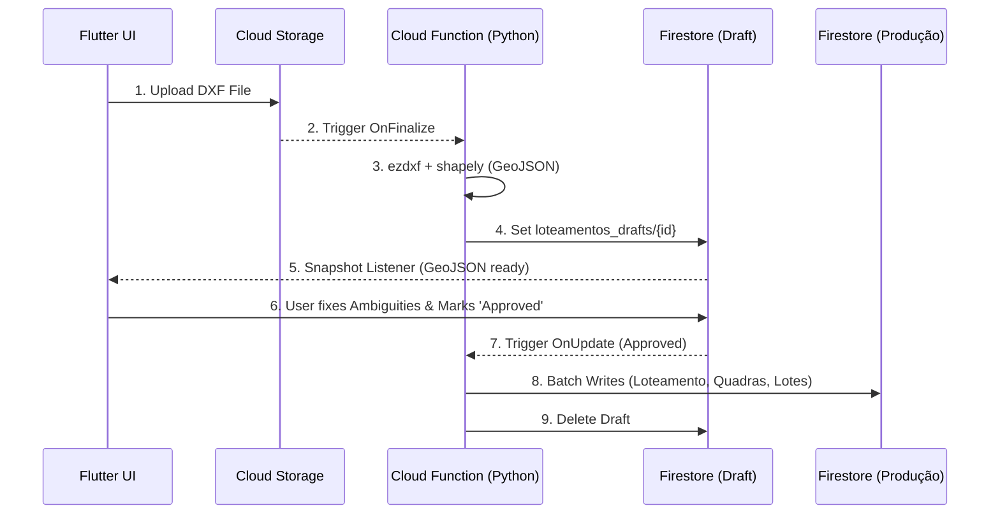

# Diagramas de Arquitetura - Importação de DXF

## Fluxo de Ingestão de Dados

```mermaid
sequenceDiagram
    participant Flutter UI
    participant Cloud Storage
    participant Cloud Function (Python)
    participant Firestore (Draft)
    participant Firestore (Produção)

    Flutter UI->>Cloud Storage: 1. Upload DXF File
    Cloud Storage-->>Cloud Function (Python): 2. Trigger OnFinalize
    Cloud Function (Python)->>Cloud Function (Python): 3. ezdxf + shapely (GeoJSON)
    Cloud Function (Python)->>Firestore (Draft): 4. Set loteamentos_drafts/{id}
    Firestore (Draft)-->>Flutter UI: 5. Snapshot Listener (GeoJSON ready)
    Flutter UI->>Firestore (Draft): 6. User fixes Ambiguities & Marks 'Approved'
    Firestore (Draft)-->>Cloud Function (Python): 7. Trigger OnUpdate (Approved)
    Cloud Function (Python)->>Firestore (Produção): 8. Batch Writes (Loteamento, Quadras, Lotes)
    Cloud Function (Python)->>Firestore (Draft): 9. Delete Draft
```
